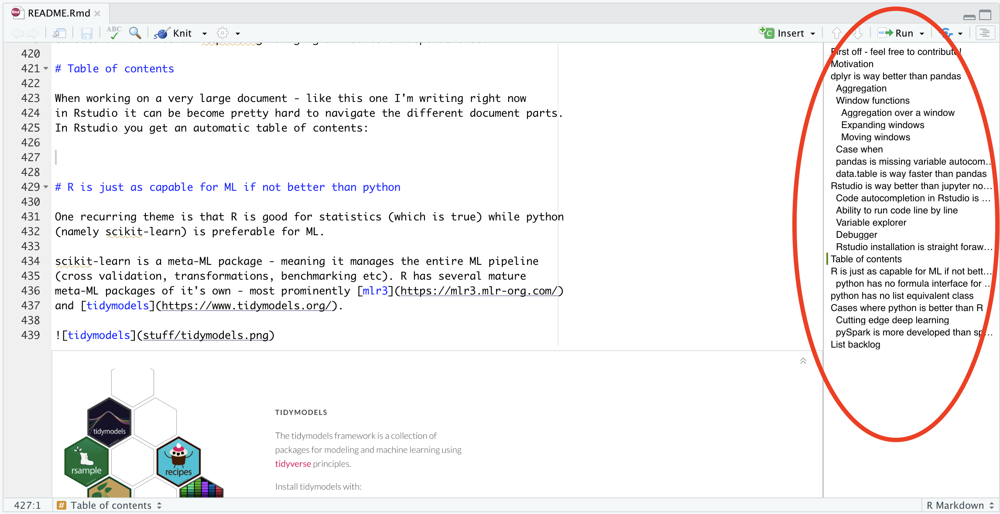
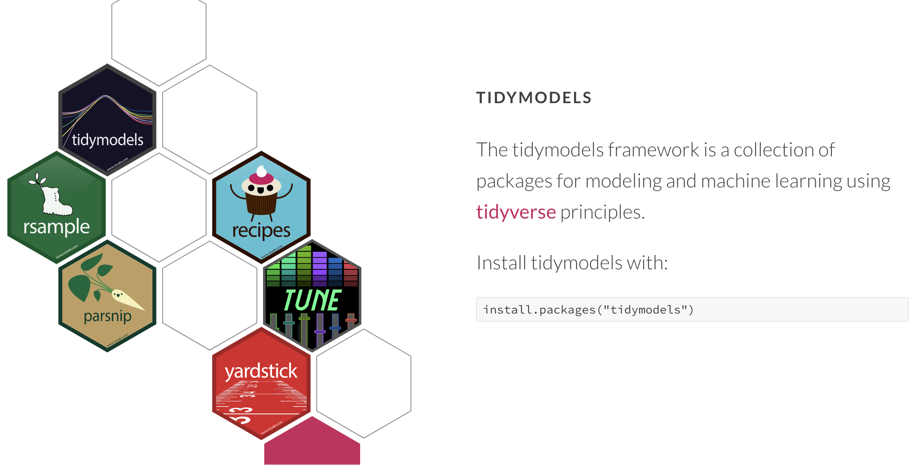
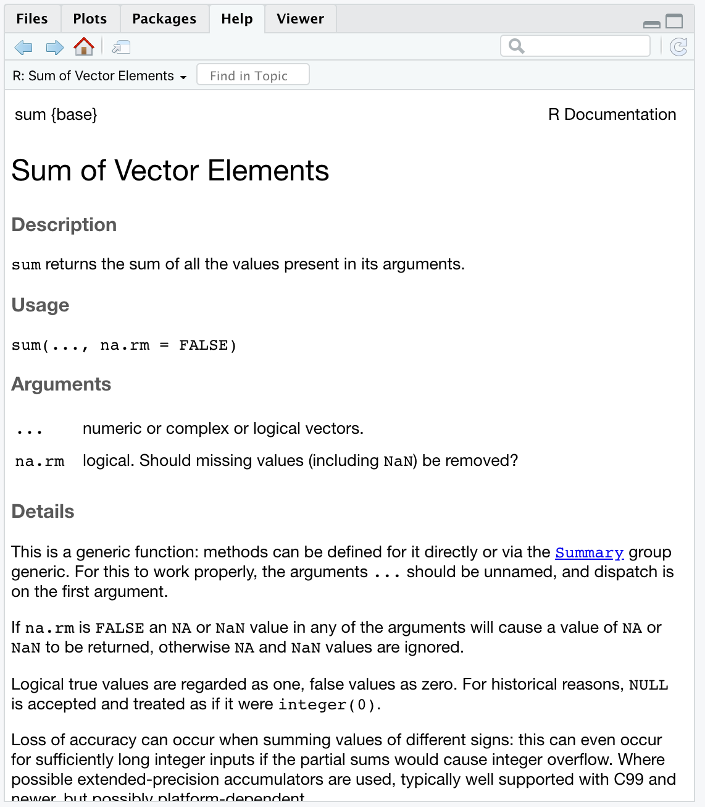

```{r setup, include=FALSE}
knitr::opts_chunk$set(echo = T, warning = F, message = F, cache = F, eval = F)
set.seed(1)
options(scipen = 999)

library(reticulate)
```

<br>

*"don't be fooled by the hype that python got*  
*R still R still is the tool you want"*


# First off - feel free to contribute!

In this document I'll be curating examples of cases where working with R is
notably faster than python. This is a living document which I'll keep updating
as I come across new examples. If you'd like to add your own feel free 
to open a pull request.

**I encourage the reader to point out cases 
where I'm wrong** - for example when better ways to perform a task in python 
exist. I've started compiling a [list](#python_better_than_r) of cases where python might be a better
solution than R but it's relatively short. Again, I encourage the reader to
help add more points to it too.

Note this repo has a [discussions section](https://github.com/IyarLin/r-is-better-than-python-for-ds/discussions) 
so feel free to comment there.

# Motivation

99.9% of all DS tasks can be done using either R or python - so why does
it even matter which one is used? The answer is: Speed. The iterative nature of
DS development means that the faster a practitioner can transform ideas to code 
and the faster that code executes - the more ideas he can explore and iterate 
over and the more productive he becomes. 

One can probably do 99.9% of DS tasks with C++ too. But you don't see too many 
practitioners do that - it takes too long!

The argument I'll be supporting throughout this entire document is that 
**90% of DS tasks can be done with R much faster than with python**. 

Now, I know this topic is getting pretty old - there's a myriad of posts on the 
topic. (I've actually 
[posted](https://iyarlin.github.io/2019/07/11/my_2_cents_on_the_r_vs_python_squabble/) 
on the subject in the past.) Still, most are confined to high level, very 
subjective comparisons. See [here](https://www.guru99.com/r-vs-python.html#:~:text=R%20is%20mainly%20used%20for,of%20course%2C%20the%20ideal%20solution.&text=Python%20is%20a%20general%2Dpurpose%20language%20with%20a%20readable%20syntax.) for example: "R is difficult to learn at the beginning while Python is Linear 
and smooth to learn" - why? No code examples are provided, survey results etc.
Even [this](https://medium.com/@datadrivenscience/python-vs-r-for-data-science-and-the-winner-is-3ebb1a968197)
piece on medium which got quite a few claps isn't very helpful in answering which
language should one pick.

Granted, many aspects of the topic are subjective to some extent. E.g. which
language is easier to learn varies a lot between different practitioners. I do
think that a thorough comparison can greatly inform those who weigh which 
language to adopt for their DS team for example. 

Also, I can imagine sometimes there's special cases which make python 
preferable to R (e.g. cutting edge deep learning, production environment
limitations) but I believe that R is still the better choice in the vast majority 
of cases. At any rate it's worth being aware of what you lose when choosing python
over R.

# dplyr is way better than pandas

Many popularity comparisons show stackoverflow questions to indicate that pandas
popularity is growing much faster than dplyr. I think that at least some of the
increase in pandas questions has to do with how confusing pandas is to all those 
new comers. I hope by the end of this section you'll find merit in my hypothesis.

{width=500px}

```{r, echo=FALSE, eval=T}
library(dplyr)
iris <- read.csv("stuff/iris.csv")
```

```{python, echo=FALSE}
import pandas as pd
import pandas as np
iris = pd.read_csv("stuff/iris.csv")
```

<a name="aggregation"></a>

## Aggregation 

We'll start with a simple example: calculate the mean Sepal length within each
species in the iris dataset.

In dplyr:

```{r}
iris %>% 
  group_by(Species) %>% 
  summarise(mean_length = mean(Sepal.Length))
```

A common way of doing the same in pandas would be using the *aggregate* method:

```{python}
(
  iris.groupby('Species').agg({'Sepal.Length':'mean'})
  .rename({'Sepal.Length':'mean_length'}, axis = 1)
)
```

We can see that pandas requires an additional *rename* call.

We can avoid the additional *rename* by passing a tuple to *agg*: 

```{python}
iris.groupby('Species').agg(mean_length = ('Sepal.Length', 'mean'))
```

While this looks much closer to the dplyr syntax, it also highlights the fact
there's multiple ways of using the agg method - contrary to common wisdom that
in R there are many ways to do the same thing while in python there's only a 
single obviuos way.

Now let's say we'd like to use a weighted average (with sepal width as weights). 

In dplyr we'd use the weighted mean funciton with an additional argument:

```{r}
iris %>%
  group_by(Species) %>%
  summarize(weighted_mean_length = weighted.mean(Sepal.Length, Sepal.Width))
```

Pretty straight forward. In fact, it's so straight forward we can do the actual 
weighted mean calculation:

```{r}
iris %>%
  group_by(Species) %>%
  summarize(weighted_mean_length = sum(Sepal.Length * Sepal.Width)/sum(Sepal.Width))
```

In pandas it's not so simple. One can't just tweak the above examples. To come 
up with a pandas version I had to search stackoverflow and based on 
[this](https://stackoverflow.com/a/10964938/5472037) and 
[this](https://stackoverflow.com/a/47103408/5472037) answers I got:

```{python}
def weighted_mean(group):
    d = {}
    x = group['Sepal.Length']
    w = group['Sepal.Width']
    d['weighted_mean_length'] = (x * w).sum() / w.sum()
    return pd.Series(d, index=['weighted_mean_length'])

sepal_length_to_width_ratio = (
  iris
  .groupby('Species')
  .apply(weighted_mean)
)
```

We can see that:  
1. We have to define a custom function, and it can't even work for general inputs  
but rather has to have them hard coded.  
2. The syntax is super cumbersome and requires searching stackoverflow.  
3. We need to use *apply* instead of the common *agg* method.  
4. I'm pretty sure anyone not using the above code for more than a few weeks
would have to search stackoverflow/his code base again to find the answer next
time he needs to do that calculation.  

## Window functions

### Aggregation over a window

Let's say we'd like to calculate the mean of sepal length within each species
and append that to the original dataset (In SQL: SUM(Sepal.Length) OVER(partition by Species)) would be:

```{python}
iris.assign(mean_sepal = lambda x: x.groupby('Species')['Sepal.Length'].transform(np.mean))
```

We can see that this requires a dedicated method (*transoform*), compared with 
dplyr which which builds on the familiar basic syntax:

```{r}
iris %>% group_by(Species) %>% mutate(mean_sepal = mean(Sepal.Length))
```

I wasn't able to come up with a way to use a function with more than 1 input
such as weighted mean in pandas. In dplyr it's pretty straight forward and again,
just a minor and intuitive tweak of the previuos code:

```{r}
iris %>% group_by(Species) %>% mutate(mean_sepal = weighted.mean(Sepal.Length, Sepal.Width))
```

### Expanding windows

Now let's say we'd like to calculate an expanding sum (in SQL: SUM(Sepal.Length) 
OVER(partition by Species ORDER BY Sepal.Width)) 

In dplyr it's pretty straight forawrd:

```{r}
iris %>% arrange(Species, Sepal.Width) %>% group_by(Species) %>% 
  mutate(expanding_sepal_sum = sapply(1:n(), function(x) sum(Sepal.Length[1:x])))
```

Notice we don't need to memorise any additional functions/methods. You find 
a solution using ubiquitous tools (e.g. sapply) and just plug it in the dplyr 
chain.

In pandas we'll have to search stackoverflow to come up with the *expanding*
method:

```{python}
(
  iris.sort_values(['Species', 'Sepal.Length']).groupby('Species')
  .expanding().agg({'Sepal.Length': 'sum'})
  .rename({'Sepal.Length':'expanding_sepal_sum'}, axis = 1)
)
```

Again, we need to use an additional *rename* call.

You'd might want to pass a tuple to *agg* like you're used to in order to avoid
the additional *rename* but for some reason the following syntax just wont work:

```{python}
(
  iris.sort_values(['Species', 'Sepal.Length']).groupby('Species')
  .expanding().agg(expanding_sepal_sum = ('Sepal.Length', 'sum'))
)
```

You could also avoid the additional rename by using the following eye sore:

```{python}
(
  iris.assign(expanding_sepal_sum = lambda x:x.sort_values('Sepal.Length')
                .groupby('Species').expanding().agg({'Sepal.Length': 'sum'})
                .reset_index()['Sepal.Length'])
)
```


### Moving windows

Now let's say we'd like to calculate a moving central window mean (in SQL: AVG(Sepal.Length) 
OVER(partition by Species ORDER BY Sepal.Width ROWS BETWEEN 2 PRECEDING AND 2 FOLLOWING)) 

As usual, in dplyr it's pretty straightforward:

```{r}
iris %>%
  arrange(Species, Sepal.Width) %>%
  group_by(Species) %>%
  mutate(moving_mean_sepal_length = sapply(1:n(), function(x) mean(Sepal.Length[max(x-2,1):min(x+2,n())])))
```
As in the other examples, all you have to do is find a solution using ubiuitous 
tools and plug it in the dplyr chain.

In pandas we'd have to look up the *rolling* method, read it's documentation and
come up with the following:

```{python}
(
  iris.sort_values(['Species', 'Sepal.Width']).groupby('Species')
  .rolling(window = 5, center = True, min_periods = 1).agg({'Sepal.Length': 'mean'})
  .rename({'Sepal.Length':'moving_mean_sepal_length'}, axis = 1)
)
```


## Case when

Below we can see an example of using case when in dplyr:

```{r}
iris %>% 
  mutate(nice = case_when(
    Species == "setosa" & Sepal.Length < 5 ~ "value C", 
    Species == "versicolor" & Sepal.Length < 5 ~ "Value A", 
    Species == "virginica" & Sepal.Length < 5 ~ "Value G", 
    T ~ "high"
  ))
```

pandas on the other hand has no dedicated case when function. It uses the numpy
select:

```{python}
iris.assign(wow = lambda x: np.select(
    [
        (x['Species'] == "setosa") & (x['Sepal.Length'] < 5), 
        (x['Species'] == "versicolor") & (x['Sepal.Length'] < 5),
        (x['Species'] == "virginica") & (x['Sepal.Length'] < 5)
    ], 
    [
        'value C', 
        'value A',
        'value G'
    ], 
    default='high'))
```

We can see that:

1. The syntax is way less readable  
2. It can get quite messy to understand what value results from what condition
if the list of conditions becomes long

## pandas is missing variable autocompletion 

In dplyr data masking enables you to have variable completion when write
your code. See below how that looks like:


In pandas whenever you select variables, pass variables to agg method, 
use sort_values, use filter method etc you pass string 
variables names, meaning no autocompletion for you.

## data.table is way faster than pandas

For most cases when working with data frames that fit in memory there will probably
be not difference in compute time between *pandas* and *dplyr*/*data.table*. 
There are instances however when working with medium to large datasets where 
*pandas* will significantly lag behind *data.table*. There's a whole [website](https://h2oai.github.io/db-benchmark/) 
dedicated to benchmarking data base like operations across many platforms. We
can see below an example where *data.table* is the fastest out there, leaving 
*pandas* (among others) in the dust.


python users might rejoice over the fact *pandas* seems much faster than *dplyr*.
Thing is *dplyr* can use *data.table* as a backend and enjoy all the [syntax joy](#aggregation)
of dplyr [without losing much steam](https://iyarlin.medium.com/data-table-speed-with-dplyr-syntax-yes-we-can-51ef9aaed585). 

# Rstudio is way better than jupyter notebooks

Working with Rmarkdown within Rstudio really feels like jupyter notebooks on
steroids. In addition to the ability to assemble code, plots and tables within
the same document you get tons of other useful features. Since there are some many,
below I'll list just a few notable features that make Rstudio so much better to
work with than jupyter notebooks.

## Code autocompletion

Below we can see a code completion example in Rstudio:


We can see that:

1. When calling functions you get documentation of arguments on the go, both
overview and detailed in pop-up windows  
1. Used arguments don't show up in the autocompletion (after setting x it 
doesn't show up again)  
1. When calling functions in a dplyr chain you have the data frame variables
listed and autocompleted (thanks to data masking)  

In constrast see below the autocompletion results for pandas DataFrame in 
jupyter notebooks:


We can see you get a long list of irrelevant stuff.

## Ability to run code line by line

Running code line by line can be especially important when you want to debug a
chunk of code. See an example below:

<a name="previuos_example"></a>


In jupyter notebooks you'd have to copy each line seperately to a new cell, 
fix indentation and run it.

In the above we not only see how easy it is to debug a function in Rstudio, 
we also see a run status bar on the left showing you exactly where the error 
occurred when running the chunk as a whole (which can also be useful when running 
big chunks to know where in the chunk your code runs right now).

## Variable explorer

In the [previous example](#previuos_example) we could also see a variable explorer which does not 
exist in jupyter notebooks. Comes handy especially when context switching or
to dynamically inspect results (e.g. number of rows in a filtered dataframe).

## Debugger

Rstudio has a full fledged [visual debugger!](https://support.rstudio.com/hc/en-us/articles/205612627-Debugging-with-RStudio) The Jupyter blog [announced](https://blog.jupyter.org/a-visual-debugger-for-jupyter-914e61716559)
a visual debugger back in March 2020 but I have yet to see it installed anywhere 
in practice. It's possible that's due to the fact it's still experimental and
available for a specific kernel type.

*"The only kernel implementing this protocol, for now, is xeus-python a new 
Jupyter kernel for the Python programming language"*

This naturally leads to the next point:

## Installation and dependency management

To take advantage of all the features in Rstudio you need only download the 
latest version and install. Jupyter notebooks are much more fragmented with 
many of the more advanced features installed separately, often working on only
subsets of machines or requiring managing all sorts of dependencies.

## Table of contents

When working on a very large document - like this one I'm writing right now
in Rstudio it can be become pretty hard to navigate the different document parts.
In Rstudio you get an automatic table of contents:



# R is just as capable for ML if not better than python

One recurring theme is that R is good for statistics (which is true) while python
(namely scikit-learn) is preferable for ML.

scikit-learn is a meta-ML package - meaning it manages the entire ML pipeline 
(cross validation, transformations, benchmarking etc). R has several mature 
meta-ML packages of it's own - most prominently [mlr3](https://mlr3.mlr-org.com/) 
and [tidymodels](https://www.tidymodels.org/).


You can read more about mlr3 and tidymodels in this great [blog post](https://medium.com/analytics-vidhya/meta-machine-learning-aggregator-packages-in-r-round-ii-71ee1ff68642). 
While it's hard to compare sklearn with the R packages, it's safe to say R has 
no shortage of high quality meta-ML packages.

## python has no formula interface for models

I think this is easily one of the most overlooked aspect of R: the formula 
interface. It makes model fitting and predicting much easier and concise. 
Using simple symbolic notation the user can define the target and
predictor variables, as well as all sorts of transformations. Using the formula
prescription R goes ahead and creates the design matrix, including one-hot 
encoding string/factor variables, applying transformations and fitting the model. 

See for example:

```{r, eval=T}
library(splines)
train_ind <- sample.int(nrow(iris), 100)
train_set <- iris[train_ind, ]
test_set <- iris[-train_ind,]
lm_model <- lm(Sepal.Length ~ poly(Petal.Length,3) + ns(Sepal.Width, 2) + Species, data = train_set)
lm_model
```

We can see that using a simple formula R went and:

1. Added an intercept column  
2. Generated 3 columns for the $1^{st}$, $2^{nd}$ and $3^{rd}$ degree orthogonal 
polynomials of Petal.Length  
3. Calculated the Sepal.Width natural cubic spline of with 2 nots.  
4. One-hot encoded the Species variable  

Now imagine trying to code all of this yourself! The magic doesn't end here though:
We can use the resulting model to generate predictions on new sets (that contain
at least the variables used for the model fit) and the model object will take 
care of recreating the design matrix using the transformation parameters obtained
in the model fit stage (e.g. knot locations):

```{r, eval=T}
new_pred <- predict(lm_model, newdata = test_set)
head(new_pred)
```


Doing the same with sklearn transformers for example would've taken way more 
effort.

## sklearn does not support categorical variables in decision trees

This one's actually pretty important. When constructing a tree in R on a dataset
that contains a categorical variable it can send several categories down each node.

To show that I'll use the iris dataset and create a "sub-species" variable which
is just a split in half of every species (so 6 levels overall).

We next fit a tree model:

```{r, eval=T}
library(rpart)
set.seed(1)
iris_for_tree <- iris %>% mutate(subspecies = 
                                   paste0(Species, sample.int(2, size = n(), 
                                                              replace = T))) %>%
  select(Sepal.Length, subspecies)

rpart(Sepal.Length ~ subspecies, data = iris_for_tree, cp = 0.02)
```

We can see that on the first split 2 categories (setosa1,setosa2) went down the
left node while the rest went to the right - which makes sense as there's no
real difference between setosa1 and setosa2. In the end the tree split the nodes
exactly according to the original species!

sklearn however [does not support categorical data](https://scikit-learn.org/stable/modules/tree.html#tree-algorithms-id3-c4-5-c5-0-and-cart).
This means we have to one hot encode those - effectively meaning you can only do
one vs the rest splitting. In the example above setosa1 and setosa2 can't be sent
together to the same node and you'd end up making bad splits with the same specie
in different leaves. This can have serious implications, especially in cases 
where categories with a large number of levels are present in the dataset.

# python has no list equivalent class

In R the list data structure let's one store arbitrary objects in a vector
which can be accessed by both element index and element name. For example:

```{r}
r_list <- list(a_vector = c("a","c","R"), a_scalar = 3, 
               another_list = list("yay", c(1,3)))

## access by index:
r_list[[1]]

## access by names:
r_list$a_scalar
```

In python one can either store data in a list which can be accessed by element
index but has no names:

```{python}
python_list = [["a","c","R"], 3, ["yay", [1,3]]]
python_list[2]
```

or in a dictionary which allows accessing elements by name but not by element 
index (in fact it has no ordering at all!)

```{python}
python_dict = {
'a_vector':["a","c","R"], 
'a_scalar':3, 
'another_list':["yay", [1,3]]}
python_dict['a_vector']
```

# Packages in R are much easier to pick up

In R every package that is hosted on CRAN needs to satisfy a list of requirements
that ensure it's well documented and usable. 

One might argue that this stifles code sharing but package hosting and installing
from github is pretty straightforward in R. I do that myself.

## Depndencies management

R package versions rarely break your code - things that used to work just keep 
working in new versions. 

When you pick up a new library in python it's not rare to need to either downgrade
or look up very specific library versions that work with the one you're trying
to use. This problem is so big that using virtual environments becomes almost a
necessity in order to have any change of managing all the dependencies across different
projects.

The *packrat* package in R fulfills the same functionality but one rarely **has** 
to use it. It's more for maintaining reproducibility.

## documentation

Documentation in R has a predetermined structure. They all need to have a title,
a description, usage pattern, arguments, details section etc which makes reading
new documentation much easier because you know what to expect and where to look
for the information you're after.

R documentation is also rendered very nicely in the Rstudio IDE (not strictly an 
R feature by itself I admit):



<a name="python_better_than_r"></a>

# Cases where python is better than R

Below are a few cases where I concede python can be easier/faster to work with
than R. 

## Cutting edge deep learning

Both R and python has mature API's for the 2 main deep learning frameworks - 
tensorflow and pytorch. Both also have an API for Keras. These probably cover
the vast majority of use cases in deep learning. 

For the most cutting edge models it might be preferable to use python directly
(instead of through *reticulate*) as these are usually developed with python and
their experimental nature often necessitates being able to look under the hood
and dealing with complex configurations.

## pySpark is more developed than sparkR/sparklyr (?)

One of the most popular tools to deal with big data is Apache Spark. Both python
and R has API's for spark (*pyspark* for python and *SparkR* and *sparklyr* in R).

The beauty of *sparklyr* is that it enables one to use spark with *dplyr* syntax.
So if you know *dplyr* you get spark for free. Pretty good for standard operations.

Until recently I thought pyspark was more advanced than SparkR due to having
pandas UDF, but now I'm not entirely sure as I just read a [post](https://cosminsanda.com/posts/a-compelling-case-for-sparkr/) about how to 
deploy pretty much every R ML package using the Spark engine. 

# List backlog

- R Rstudio IDE is superior to Jupyter notebooks in every single way. It's 
notebook features are better, it's installation is easier and comes with all
features. Some versions of jupyter might have some of the features - e.g. 
variable explorer but it's the difficulty of installing those that makes those
features rarely available in practice and increase friction when setting up the
environment.
- python has spyder which is a poor man's version of Rstudio, so no point 
discussing it.
- In Rstudio you can run notebooks/scripts line by line. Can't do that in jupyter.
Rstudio also has a console while jupyter doesn't. Both of these mean for example 
when debugging a function you need to copy each row to a new cell and run it, 
keep track of what's happening in your head because you don't have a variable
explorer either.
(I've seen that a visual debugger was introduced lately but I haven't seen it used anywhere).
-  Not having a variable explorer can also be confusing especially if
you context switch and need to remember what cells have you ran already. Variable
explorer also enables quick inspection of the variables (so you can see right 
away that the function you ran returned a 0-row data frame for example).
- Sketchy: Code completion in Rstudio is much better, and starts to support python too.
- Indentation in python is annoying - if you want to copy multiline code between 
sections
with different indentation levels (e.g. from a cell to within a function - show a 
small example) that can be super annoying. 
- Line breaks are also annoying in python. python is said to be more elegant but
I find those "\" at every line ending pretty weird. Another option would be putting
entire expressions in parenthesis, which again, is less elegant.

- Pipes in dplyr are natural. In pandas you often need to use different methods
(e.g. query instead of the usual filter, assign instead of regular assignment). 
Some operation can't be done in pipe (change variable type)
- R data.table is way faster than pandas. Can even use dplyr syntax with it.  
- R documentation is standardized which makes it easier to read. It also renders.  
very nicely in the Rstudio IDE. python documentation has no specific structure.
In many cases it's sorely lacking.  
- On that same vein - R has great utilities for package writing - roxygen2 for
example. 
- CRAN enforces quality standards (such as documentation). One could argue this
stifles package writing and sharing but hosting packages and installing them is
super easy - show syntax.  
- As a result of the above, python packages dependencies break a lot. The need
for virual environments is a testament for that issue. There's a way to create
virtual envs in r but one rarely needs them. See also accepted answer here: https://stackoverflow.com/questions/14529838/apply-multiple-functions-to-multiple-groupby-columns
- In cases python has some functionality missing in R, the reticulate package in 
R let's one import any python module directly into the R session (All pandas examples
in this report are written inside an R script. You can also see an example in
my [blog post](https://iyarlin.github.io/2020/04/20/dowhy_exploration/) that uses
the dowhy library from within R). Python has several packages that aim to do the 
same but none are as mature.  
- Python sklearn decision trees do not support categorical features - only 1-hot
encoded ones. This means you can only do splits of 1-vs-rest in categorical 
features. This could have significant effects, especially for variables with a
large number of categories.  
- Plotting in R is much stronger. This may be a bit subjective as to which
graphics look better - ggplot2 or matplotlib/seaborn. python has also plotnine
but it's way less feature rich, and does not have the myriad of extension 
pacakge as in r (e.g. gganimate).  
- It is said that python is better for ML due to sklearn. But has mlr and 
tidymodels, both very capable meta ML packages.
- python was not built from the ground up for DS. For that reason mathematical
constructs are a 2nd class citizens in it. This is most apparent in the amount
of libraries invovled with basic DS operations, each with it's own code philosphy
(pandas, numpy, sklearn, scipy etc). In R it all just fits together. 
- Pandas index is pretty useless. You can see how often you'll use reset_index().
)
- python copy inplace is really confusing (x = y, if you change y so does x)
- python indexing starts with 0 which is confusing
- Rmarkdown greatly expands the ability to communicate results, especially with
non technical colleagues. It easily let's one render his Rmd into word, html, md,
pdf etc and share those. I have an entire site built using Rmarkdown. In order
to view ipynb files one needs access to github or specialized software.
- dplyr syntax can be used with multiple backends: spark, postgres, data.table
and many others. While some functionality may not be supported, it can still save
a lot of time. 

**python strong points**
- R spark interface is less powerful. For example: pandas UDF. 

