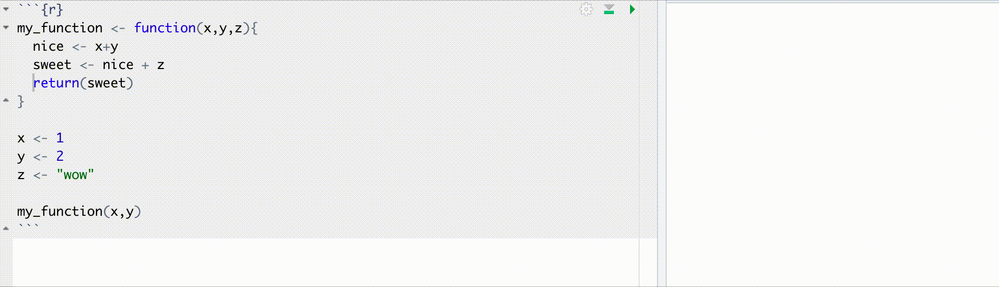
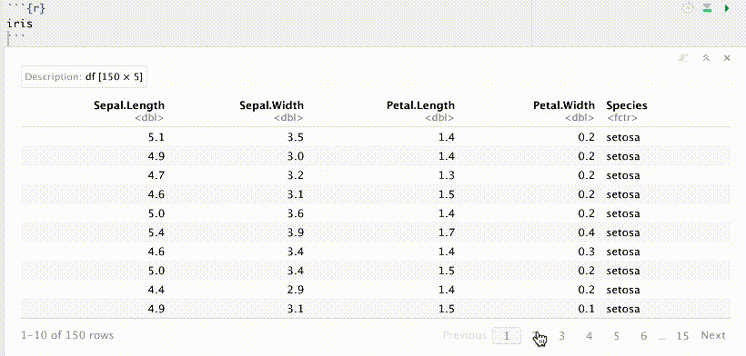
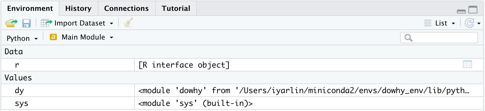

```{r setup, include=FALSE}
knitr::opts_chunk$set(echo = T, warning = F, message = F, cache = F, eval = F)
set.seed(1)
options(scipen = 999)

library(reticulate)
```

<br>

*"don't be fooled by the hype python's got*  
*R still R still is the tool you want"*


# Motivation

R has many advantages over python that should be taken into consideration when
choosing which language to do DS with. When compiling them in this repo I try to
avoid:

1. Too subjective comparisons. E.g. function indentation vs curly braces closure.
1. Issues that one can get used to after a while like python indexing (though the 
fact it starts from 0, or that object[0:2] returns only the first 2 
elements still throws me off once in a while). 

## How to contribute

I'm adding examples to this repo as I encounter them. There are areas such as 
dashboards and apps, advanced statistics or production environemnts with which I'm 
less familiar with. If you'd like to add examples, including where python has the 
edge over R (there's a small [section](#python_better_than_r) for that) feel free 
to add them to this README and open a pull request.

**I encourage the reader to point out cases 
where I'm wrong** - for example when better ways to perform a task in python 
exist. I appreciate the feedback.

Note this repo has a [discussions section](https://github.com/IyarLin/R-advantages-over-python/discussions) 
so feel free to comment there.

# Working with dplyr is much faster than pandas

Many popularity comparisons show stack overflow questions to indicate that pandas
popularity is growing much faster than dplyr. I think that at least some of the
increase in pandas questions has to do with how confusing pandas is. 
I hope by the end of this section you'll find merit in my hypothesis.

{width=500px}

```{r, echo=FALSE, eval=T}
library(dplyr)
iris <- read.csv("stuff/iris.csv")
```

```{python, echo=FALSE, eval=T}
import pandas as pd
import numpy as np
iris = pd.read_csv("stuff/iris.csv")
```

<a name="aggregation"></a>

## Aggregation 

This section will demonstrate that pandas syntax really 
contrasts with the principle from Zen of python: "There should be one— and preferably 
only one —obvious way to do it".

We'll start with a simple example: calculate the mean Sepal length within each
species in the iris dataset. 

In dplyr:

```{r}
iris %>%
  group_by(Species) %>%
  summarise(mean_length = mean(Sepal.Length))
```

A common way of doing the same in pandas would be using the *agg* method:

```{python}
(
  iris
  .groupby('Species')
  .agg({'Sepal.Length':'mean'})
  .rename({'Sepal.Length':'mean_length'}, axis = 1)
)
```

We can see that pandas requires an additional *rename* call.

We can avoid the additional *rename* by passing a tuple to *agg*: 

```{python}
iris.groupby('Species').agg(mean_length = ('Sepal.Length', 'mean'))
```

When aggregating over a single column we could pass a string rather than a tuple
like so:

```{python}
iris.groupby('Species')['Sepal.Length'].agg(mean_length = 'mean')
```

When aggregating over a single column with a function that is also a DataFrame
method one could skip the *agg* method altogether using:

```{python}
iris.groupby('Species')['Sepal.Length'].mean()
```

### Multiple input variables (weighted average example)

Now let's say we'd like to use a weighted average (with sepal width as weights). 

In dplyr we'd use the weighted mean function with an additional argument:

```{r}
iris %>%
  group_by(Species) %>%
  summarize(weighted_mean_length = weighted.mean(Sepal.Length, Sepal.Width))
```

Pretty straight forward. In fact, it's so straight forward we can do the actual 
weighted mean calculation on the fly:

```{r}
iris %>%
  group_by(Species) %>%
  summarize(weighted_mean_length = sum(Sepal.Length * Sepal.Width) / sum(Sepal.Width))
```

In pandas I found an [answer](https://stackoverflow.com/questions/10951341/pandas-dataframe-aggregate-function-using-multiple-columns/10964938#10964938) which got 104 upvotes on stack overflow:

```{python}
def weighted_mean(group):
    d = {}
    x = group['Sepal.Length']
    w = group['Sepal.Width']
    d['weighted_mean_length'] = (x * w).sum() / w.sum()
    return (x * w).sum() / w.sum()

(
  iris
  .groupby('Species')
  .apply(weighted_mean)
)
```

Problem is - we get back a series, not a DataFrame. I've searched stack overflow
some more and combined the above with this [answer](https://stackoverflow.com/questions/14529838/apply-multiple-functions-to-multiple-groupby-columns/47103408#47103408)
(look how long it is!) to get the following:

```{python}
def weighted_mean(group):
    d = {}
    x = group['Sepal.Length']
    w = group['Sepal.Width']
    d['weighted_mean_length'] = (x * w).sum() / w.sum()
    return pd.Series(d, index=['weighted_mean_length'])

(
  iris
  .groupby('Species')
  .apply(weighted_mean)
)
```

We can see that:  
1. We have to define a custom function, and it can't even work for general inputs  
but rather has to have them hard coded.  
2. The syntax is super cumbersome and requires searching stack overflow extensively.  
3. We need to use *apply* instead of the common *agg* method.  
4. I'm pretty sure anyone not using the above code for more than a few weeks
would have to search stack overflow/his code base again to find the answer next
time he needs to do that calculation.  

Following a [Christophe's](https://medium.com/@christopherpynn) comment on my Medium 
post I found out there's a much simpler solution:

```{python}
(
  iris
  .groupby('Species')
  .apply(lambda x: pd.Series({'weighted_mean_length': 
    np.average(x['Sepal.Length'], weights = x['Sepal.Width'])}))
)
```

Quite surprising given the amount of upvotes those stack overflow answers got.

Another comment by [Samuel Oranyeli](https://gist.github.com/samukweku/88272c539743e9507dd275e1d2d71018) 
revealed one could actually use the *pipe* method like so:

```{python}
(
  iris
  .assign(weighted_sum = iris['Sepal.Length'].mul(iris['Sepal.Width']))
  .groupby('Species')
  .pipe(lambda df: df.weighted_sum.sum()/df['Sepal.Width'].sum())
)
```

So... using yet another new method: *pipe*, which quite frankly I have a hard
time understanding how is different than *apply*. (There's an active stack
overflow [question](https://stackoverflow.com/questions/47226407/pandas-groupby-pipe-vs-apply#:~:text=1%20Answer&text=What%20pipe%20does%20is%20to,that%20was%20passed%20to%20apply%20.) on that).

### Multiple functions on multiple input variables

Let's say we'd like to calculate the mean and max sepal length, and the min sepal 
width. 

pandas has a very different behavior when the data frame is grouped or not. When 
it's ungrouped:

```{python, eval=T}
(
  iris
  .agg({'Sepal.Length':['mean', 'max'], 'Sepal.Width':'min'})
)
```

We can see that the functions were stored in the index while the variables on 
which they were operated on are in the columns. This results in all those NaNs.

If we were to apply those functions to a grouped data frame however:

<a name="multi_index"></a>

```{python, eval=T}
(
  iris
  .groupby('Species')
  .agg({'Sepal.Length':['mean', 'max'], 'Sepal.Width':'min'})
)
```

Now the grouping variable levels occupy the row index while the functions and variables
were moved to the column multi index. It prints nicely but also begs the question
which you'll have go search stack overflow of how do you rename those columns or
select them by name. 

## Window functions

### Aggregation over a window

Let's say we'd like to calculate the mean of sepal length within each species
and append that to the original dataset (In SQL: SUM(Sepal.Length) OVER(partition by Species)) would be:

```{python}
iris.assign(mean_sepal = lambda x: x.groupby('Species')['Sepal.Length'].transform(np.mean))
```

We can see that this requires a dedicated method (*transform*), compared with 
dplyr which only requires adding a group_by:

```{r}
iris %>%
  group_by(Species) %>%
  mutate(mean_sepal = mean(Sepal.Length))
```

Now let's say we'd like to do the same with a function that takes 2 argument 
variables. In dplyr it's pretty straight forward and again,
just a minor and intuitive tweak of the previous code:

```{r}
iris %>%
  group_by(Species) %>%
  mutate(mean_sepal = weighted.mean(Sepal.Length, Sepal.Width))
```

Thanks to [Samuel Oranyeli](https://gist.github.com/samukweku/88272c539743e9507dd275e1d2d71018) 
I now know this can be achieved in pandas using:

```{python}
(
  iris
  .assign(weighted_sum = iris['Sepal.Length'].mul(iris['Sepal.Width']), 
             mean_sepal = lambda df: df.groupby('Species')
                                       .pipe(lambda df: df.weighted_sum.transform('sum')/
                                                        df['Sepal.Width'].transform('sum'))
                                            )
     .drop(columns = "weighted_sum")
)
```

You can judge for yourself how elegant or straightforward this is. 

### Expanding windows

Now let's say we'd like to calculate an expanding sum of Sepal.Length over increasing
values of Sepal.Width within each species (in SQL: SUM(Sepal.Length) 
OVER(partition by Species ORDER BY Sepal.Width)) 

In dplyr it's pretty straight forward:

```{r}
iris %>%
  arrange(Species, Sepal.Width) %>%
  group_by(Species) %>%
  mutate(expanding_sepal_sum = sapply(1:n(), function(x) sum(Sepal.Length[1:x])))
```

Notice we don't need to memorize any additional functions/methods. You find 
a solution using ubiquitous tools (e.g. sapply) and just plug it in the dplyr 
chain.

In pandas we'll have to search stack overflow to come up with the *expanding*
method:

```{python}
(
  iris
  .sort_values(['Species', 'Sepal.Width'])
  .groupby('Species')
  .expanding().agg({'Sepal.Length': 'sum'})
  .rename({'Sepal.Length':'expanding_sepal_sum'}, axis = 1)
)
```

Again, we need to use an additional *rename* call.

You'd might want to pass a tuple to *agg* like you're used to in order to avoid
the additional *rename* but for some reason the following syntax just wont work:

```{python}
(
  iris
  .sort_values(['Species', 'Sepal.Width'])
  .groupby('Species')
  .expanding()
  .agg(expanding_sepal_sum = ('Sepal.Length', 'sum'))
)
```

You could also avoid the additional rename by using the following somewhat 
cumbersome syntax:

```{python}
(
  iris
  .assign(expanding_sepal_sum = lambda x:x.sort_values(['Species', 'Sepal.Width'])
  .groupby('Species').expanding().agg({'Sepal.Length': 'sum'})
  .reset_index()['Sepal.Length'])
)
```

Yet another way of doing it (credit to [Samuel Oranyeli](https://gist.github.com/samukweku/88272c539743e9507dd275e1d2d71018)) 
would be: 

```{python}
(
  iris
  .sort_values(["Species", "Sepal.Width"])
  .assign(expanding_sepal_sum = lambda df: df.groupby("Species")['Sepal.Length']
                                                .expanding()
                                                .sum()
                                                .array)
)
```


### Moving windows

Now let's say we'd like to calculate a moving central window mean (in SQL: AVG(Sepal.Length) 
OVER(partition by Species ORDER BY Sepal.Width ROWS BETWEEN 2 PRECEDING AND 2 FOLLOWING)) 

As usual, in dplyr it's pretty straightforward:

```{r}
iris %>%
  arrange(Species, Sepal.Width) %>%
  group_by(Species) %>%
  mutate(moving_mean_sepal_length = sapply(
    1:n(),
    function(x) mean(Sepal.Length[max(x - 2, 1):min(x + 2, n())])
  ))
```

As in the other examples, all you have to do is find a solution using ubiquitous 
tools and plug it in the dplyr chain.

In pandas we'd have to look up the *rolling* method, read it's documentation and
come up with the following:

```{python}
(
  iris
  .sort_values(['Species', 'Sepal.Width'])
  .groupby('Species')
  .rolling(window = 5, center = True, min_periods = 1)
  .agg({'Sepal.Length': 'mean'})
  .rename({'Sepal.Length':'moving_mean_sepal_length'}, axis = 1)
)
```

Yet another way of doing it (credit to [Samuel Oranyeli](https://gist.github.com/samukweku/88272c539743e9507dd275e1d2d71018)) 
would be: 

```{python}
(
  iris
  .sort_values(["Species", "Sepal.Width"])
  .assign(expanding_sepal_sum = lambda df: df.groupby("Species")['Sepal.Length']
                                                .rolling(window=5, center=True, min_periods=1)
                                                .mean()
                                                .array)
)
```


## Case when

Below we can see an example of using a case when statement in dplyr:

```{r}
iris %>%
  mutate(nice = case_when(
    Species == "setosa" & Sepal.Length < 5 ~ "value C",
    Species == "versicolor" & Sepal.Length < 5 ~ "Value A",
    Species == "virginica" & Sepal.Length < 5 ~ "Value G",
    T ~ "high"
  ))
```

pandas on the other hand [has no dedicated case when function](https://github.com/pandas-dev/pandas/issues/39154). 
It uses the **numpy** *select*:

```{python}
iris.assign(wow = lambda x: np.select(
    [
        (x['Species'] == "setosa") & (x['Sepal.Length'] < 5), 
        (x['Species'] == "versicolor") & (x['Sepal.Length'] < 5),
        (x['Species'] == "virginica") & (x['Sepal.Length'] < 5)
    ], 
    [
        'value C', 
        'value A',
        'value G'
    ], 
    default='high'))
```

We can see that:

1. The syntax is way less readable. In order to match condition with outcome one
needs to index the conditions and outcomes in his head    
2. It can get quite messy to understand which value results from what condition
if the list of conditions becomes long

## Coalesce

This function finds the first non-missing value at each position similar to SQL coalesce.

For example we try to extract first non-missing value from 2 fields otherwise return 0.
In dplyr it makes pretty easy and readable

```{r, eval=T}
df <- tibble(s1=c(NA,NA,6,9,9),s2=c(NA,8,7,9,9))
df %>% mutate(s3=coalesce(s1,s2,0))
```

In pandas the solution is much less readable and concise:

```{python, eval  =T}
df=pd.DataFrame({'s1':[np.nan,np.nan,6,9,9],'s2':[np.nan,8,7,9,9]})
df.assign(s3 = df.s1.combine_first(df.s2).fillna(0))
```

## pandas is missing variable autocompletion 

In dplyr data masking enables you to have variable completion when write
your code. See below how that looks like:


In pandas you pass strings when you select variables, use the *agg*, *sort_values*,
*query* and *groupby* methods. In all those cases - you don't get variable 
autocompletion.

## When you learn dplyr you can also leverage data.table, spark, postgres and many others

When you encounter use cases where pandas can't be used (e.g. big data and remote 
data bases) you'll have to learn another package to tackle them.

Dplyr users however can use the same syntax to tackle many use cases using various
other languages as backends. Granted, for advanced usage one would probably have
to resort to more dedicated API's or use the native language itself. But for the
usual use cases of filtering, selecting, aggregating etc using dplyr syntax 
should work fine.

The [dbplyr](https://dbplyr.tidyverse.org/) package enables using remote database 
tables as if they are in-memory data frames by automatically converting dplyr 
code into SQL. These include: Postgres, BigQuery, Impala and many others.

The [sparklyr](https://spark.rstudio.com/) package enables connecting to spark 
clusters and executing spark jobs by converting dplyr syntax to Spark syntax.

The [dtplyr](https://dtplyr.tidyverse.org/) package enables working fast 
with large data frames that still fit in memory by using the data.table package
as backend. You can see a [small benchmarking](https://iyarlin.medium.com/data-table-speed-with-dplyr-syntax-yes-we-can-51ef9aaed585) 
I did to see how effective it is.

## data.table is way faster than pandas

For most cases when working with data frames that fit in memory there will probably
be not difference in compute time between pandas and dplyr/data.table. 
There are instances however when working with medium to large datasets where 
pandas will significantly lag behind data.table. There's a whole [website](https://h2oai.github.io/db-benchmark/) 
dedicated to benchmarking data base like operations across many languages. We
can see below an example where data.table is the fastest out there, leaving 
pandas (among others) in the dust.


python users might rejoice over the fact pandas seems much faster than dplyr.
Thing is dplyr can use data.table as a backend and enjoy all the [syntax joy](#aggregation)
of dplyr [without losing much steam](https://iyarlin.medium.com/data-table-speed-with-dplyr-syntax-yes-we-can-51ef9aaed585). 

## pandas index

This one might be a bit subjective, but for me pandas index always seems like 
much more of nuisance than useful. I encourage the reader to check how many 
times they use the *reset_index* method in their code. Other than some niceties
relating to how the data frame is printed (e.g. multi indeces, see [this](#multi_index)
for example) I can't think of a use case where an index is really needed.

# Rstudio IDE is way better than jupyter notebooks

When working with python one might opt to use the [spyder IDE](https://www.spyder-ide.org/).
Last time I checked it was a poor mans' Rstudio so I restrict my comparison to
jupyter notebooks which are by far the most popular IDE for DS python.

Working with Rmarkdown within Rstudio really feels like jupyter notebooks on
steroids. In addition to the ability to assemble code, plots and tables within
the same document you get tons of other useful features. Since there are some many,
below I'll list just a few notable features that make Rstudio so much better to
work with than jupyter notebooks.

## Code autocompletion

Below we can see a code completion example in Rstudio:


We can see that:

1. When calling functions you get documentation of arguments on the go, both
overview and detailed in pop-up windows  
1. Used arguments don't show up in the autocompletion (after setting x it 
doesn't show up again)  
1. When calling functions in a dplyr chain you have the data frame variables
listed and autocompleted (thanks to data masking)  

In contrast see below the autocompletion results for pandas DataFrame in 
jupyter notebooks:


We can see you get a long list of irrelevant stuff.

## Console

Rstudio has a command line - this comes handy whenever you want to execute short
pieces of code to check stuff, not to have it in your script. Not having this
in Jupyter notebooks is a pain that is compounded by the absence of the 
following feature:

## Running code line by line

Running code line by line can be especially important when you want to debug a
chunk of code. See an example below:

<a name="previous_example"></a>



In jupyter notebooks you'd have to copy each line separately to a new cell, 
fix indentation and run it. You can't even just copy it to a console!.

In the above we not only see how easy it is to debug a function in Rstudio, 
we also see a run status bar on the left showing you exactly where the error 
occurred when running the chunk as a whole (which can also be useful when running 
big chunks to know where in the chunk your code runs right now).

Using Rstudio version 1.4.1106 on Mac I can also run python code line by line.

## Table viewing is interactive

When viewing tables with lots of rows it's useful to be able to scroll them row
wise:



In jupyter you can only scroll column wise.

## Variable explorer

In the [previous example](#previuos_example) we could also see a variable explorer which does not 
exist in jupyter notebooks. Comes handy especially when context switching or
to dynamically inspect results (e.g. number of rows in a filtered dataframe).

I'm using Rstudio version 1.4.1106 and when using the reticulate package to work
with python I have a variable explorer. At this rate using Rstudio would be 
preferable over jupyter notebooks even when using python.



## Debugger

Rstudio has a full fledged [visual debugger!](https://support.rstudio.com/hc/en-us/articles/205612627-Debugging-with-RStudio) The Jupyter blog [announced](https://blog.jupyter.org/a-visual-debugger-for-jupyter-914e61716559)
a visual debugger back in March 2020 but I have yet to see it installed anywhere 
in practice. It's possible that's due to the fact it's still experimental and
available for a specific kernel type.

*"The only kernel implementing this protocol, for now, is xeus-python a new 
Jupyter kernel for the Python programming language"*

This naturally leads to the next point:

## Installation and dependency management

To take advantage of all the features in Rstudio you need only download the 
latest version and install. Jupyter notebooks are much more fragmented with 
many of the more advanced features installed separately, often working on only
subsets of machines or requiring managing all sorts of dependencies.

## Table of contents

When working on a very large document - like this one I'm writing right now
in Rstudio it can be become pretty hard to navigate the different document parts.
In Rstudio you get an automatic table of contents:


<a name="documentation_render"></a>

## Documentation rendering

Documentation in Rstudio is rendered very nicely in a separate window, supporting
all sorts of formatting. See for example: 


In jupyter notebooks however doc strings are printed within the notebook, so if it's 
long one has to scroll up and down to view both the doc and the code he wants
to edit:


# R is just as capable for ML if not better than python

One recurring theme is that R is good for statistics (which is true) while python
(namely scikit-learn) is preferable for ML.

scikit-learn is a meta-ML package - meaning it manages the entire ML pipeline 
(cross validation, transformations, benchmarking etc). R has several mature 
meta-ML packages of it's own - most prominently [mlr3](https://mlr3.mlr-org.com/) 
and [tidymodels](https://www.tidymodels.org/).


You can read more about mlr3 and tidymodels in this great [blog post](https://medium.com/analytics-vidhya/meta-machine-learning-aggregator-packages-in-r-round-ii-71ee1ff68642). 
While it's hard to compare sklearn with the R packages, it's safe to say R has 
no shortage of high quality meta-ML packages.


## sklearn does not support categorical variables in decision trees

This one's actually pretty important. When constructing a tree in R on a dataset
that contains a categorical variable it can send several categories down each node.

To show that I'll use the iris dataset and create a "sub-species" variable which
is just a split in half of every species (so 6 levels overall).

We next fit a tree model:

```{r, eval=T}
library(rpart)
set.seed(1)
iris_for_tree <- iris %>%
  mutate(
    subspecies =
      paste0(Species, sample.int(2,
        size = n(),
        replace = T
      ))
  ) %>%
  select(Sepal.Length, subspecies)

rpart(Sepal.Length ~ subspecies, data = iris_for_tree, cp = 0.02)
```

We can see that on the first split 2 categories (setosa1,setosa2) went down the
left node while the rest went to the right - which makes sense as there's no
real difference between setosa1 and setosa2. In the end the tree split the nodes
exactly according to the original species!

sklearn however [does not support categorical data](https://scikit-learn.org/stable/modules/tree.html#tree-algorithms-id3-c4-5-c5-0-and-cart).
This means we have to one hot encode those - effectively meaning you can only do
one vs the rest splitting. In the example above setosa1 and setosa2 can't be sent
together to the same node and you'd end up making bad splits with the same specie
in different leaves. This can have serious implications, especially in cases 
where categories with a large number of levels are present in the dataset.

# python has no list equivalent class

In R the list data structure let's one store arbitrary objects in a vector
which can be accessed by both element index and element name. For example:

```{r}
r_list <- list(
  a_vector = c("a", "c", "R"), a_scalar = 3,
  another_list = list("yay", c(1, 3))
)

## access by index:
r_list[[1]]

## access by names:
r_list$a_scalar
```

In python one can either store data in a list which can be accessed by element
index but has no names:

```{python}
python_list = [["a","c","R"], 3, ["yay", [1,3]]]
python_list[2]
```

or in a dictionary which allows accessing elements by name but not by element 
index (in fact it has no ordering at all!)

```{python}
python_dict = {
'a_vector':["a","c","R"], 
'a_scalar':3, 
'another_list':["yay", [1,3]]}
python_dict['a_vector']
```

# Package management and distribution

In R every package that is hosted on CRAN needs to satisfy a list of requirements
that ensure it's well documented and usable. 

One might argue that this stifles code sharing but package hosting and installing
from github is pretty straightforward in R. I do that myself.

pypi on the other hand has no such standards and as a result, you never really
know what you get. 


*credit to Adam Soffer for the brilliant reference*

Below I elaborate on a couple of issues that arise from this setup:

## Depndencies management

R package versions rarely break your code - things that used to work just keep 
working in new versions. 

When you pick up a new library in python it's not rare to need to either downgrade
or look up very specific library versions that work with the one you're trying
to use. This problem is so big that using virtual environments becomes almost a
necessity in order to have any change of managing all the dependencies across different
projects. The headache doesn't end there as you'll need to make sense of which 
virtual environment tool to use: there's venv, virtualenv, pyenv and many more!
You can see some of the confusion manifested in this [stack overflow](https://stackoverflow.com/questions/41573587/what-is-the-difference-between-venv-pyvenv-pyenv-virtualenv-virtualenvwrappe) question.

The *packrat* package in R fulfills the same functionality but one rarely **has** 
to use it. It's more for maintaining reproducibility.

## Documentation

Documentation in R has a predetermined structure. They all need to have a title,
a description, usage pattern, arguments, details section etc which makes reading
new documentation much easier because you know what to expect and where to look
for the information you're after.

R documentation is also [rendered very nicely in the Rstudio IDE](#documentation_render) 
(not strictly an R feature by itself I admit).

# Vectorization

In R the basic objects are all vectors and thus vectorized operations are natural.
In python however the basic objects are lists so one has to either use list
comprehensions which are less readable and slower or convert the lists to numpy
arrays to get the same vectorization capabilities. 

For example let's say we'd like to multiply all elements of a vector by 2. In R:


```{r vectorizedR, eval=TRUE}
myVector <- 1:5
myVector * 2
```

Doing the same for a list would look like this:

```{python, eval=TRUE}
myList = [1,2,3,4,5]
[i*2 for i in myList]
```

This can be really slow for very large vectors. We could import the numpy module
to get the same functionality:

```{python vectorizedPy, eval=TRUE}
import numpy as np
myVector = np.arange(1,6,1) # notice how the "to" argument is 6 rather than 5.
myVector * 2
```

Here's another example: Suppose we'd like to pick elements of a vector based
on another boolean/index vector. In R:

```{r, eval=TRUE}
indexVector <- 1:5
valueVector <- LETTERS[indexVector]
greaterThan2 <- indexVector > 2
valueVector[greaterThan2]
```

Using python lists isn't so straight forward. Based on this stack overflow
[answer](https://stackoverflow.com/a/3179119) 
(which got 147 upvotes - to a question that got 113 upvotes as of 10.6.2021) you'd 
need to use list comprehension like so:

```{python, eval=TRUE}
indexVector = [1,2,3,4,5]
valueVector = [r.LETTERS[i - 1] for i in indexVector]
greaterThan2 = [indexVector[i] > 2 for i in range(len(indexVector))]
[val for is_good, val in zip(greaterThan2, valueVector) if is_good]
```

Way less elegant and possibly slow for large vectors. 
It's so un-elegant that a special function was written to accomplish the task:

```{python, eval=TRUE}
from itertools import compress
list(compress(valueVector, greaterThan2))
```

Even that solution is pretty cumbersome compared with the R native way of doing 
it.

Alternatively, one could use numpy to enjoy vectorization:

```{python, eval=TRUE}
import numpy as np
indexVector = np.arange(1,6)
valueVector = np.array(r.LETTERS)[indexVector]
greaterThan2 = indexVector > 2
valueVector[greaterThan2]
```

Do note however that numpy can't help you if the vector you're working with is
made up of different types of elements (e.g. strings and numbers). In R you can
use lists and still enjoy vectorization:

```{r, eval=TRUE}
valueVector <- list("a", 1, c(1,2,3), "wow", list("sweet", 2))
valueVector[greaterThan2]
```


<a name="python_better_than_r"></a>

# Cases where python is better than R

Below are a few cases where I concede python can be easier/faster to work with
than R. 

## Cutting edge deep learning

Both R and python has mature API's for the 2 main deep learning frameworks - 
tensorflow and pytorch. Both also have an API for Keras. These probably cover
the vast majority of use cases in deep learning. 

For the most cutting edge models it might be preferable to use python directly
(instead of through *reticulate*) as these are usually developed with python and
their experimental nature often necessitates being able to look under the hood
and dealing with complex configurations.

## pySpark is more developed than sparkR/sparklyr (?)

One of the most popular tools to deal with big data is Apache Spark. Both python
and R has API's for spark (*pyspark* for python and *SparkR* and *sparklyr* in R).

The beauty of *sparklyr* is that it enables one to use spark with dplyr syntax.
So if you know dplyr you get spark for free. Pretty good for standard operations.

Until recently I thought pyspark was more advanced than SparkR due to having
pandas UDF, but now I'm not entirely sure as I just read a [post](https://cosminsanda.com/posts/a-compelling-case-for-sparkr/) about how to 
deploy pretty much every R ML package using the Spark engine. 

# List backlog

Below is a list of points I might develop into full examples. Feel free to pick
one and expand on it!

- 

- R has great utilities for package writing - roxygen2 for
example. 

- Plotting in R is much better This may be a bit subjective as to which
graphics look better - ggplot2 or matplotlib/seaborn. python has also plotnine
but it's way less feature rich, and does not have the myriad of extension 
package as in r (e.g. gganimate).  

- Many folks like to say that one of python's greatest advantages is that it's a
general programming language. Now, I have to admit I don't understand what that
means in practice. But I do feel it's true in the sense that it feels like python
wasn't build for DS from ground up. For that reason mathematical
constructs are a 2nd class citizens in it. This is most apparent in the amount
of libraries involved with basic DS operations, each with it's own code philosophy
(pandas, numpy, sklearn, scipy etc). In R it all just fits together. Talk about tidyverse in contrast.

- python copy inplace is really confusing (x = y, if you change y so does x)

- Rmarkdown greatly expands the ability to communicate results, especially with
non technical colleagues. It easily let's one render his Rmd into word, html, md,
pdf etc and share those. I have an entire site built using Rmarkdown. In order
to view ipynb files one needs access to github or specialized software.
- dplyr syntax can be used with multiple backends: spark, postgres, data.table
and many others. While some functionality may not be supported, it can still save
a lot of time. 

- test editing tools in Rstudio are superb (find and replcae etc)
