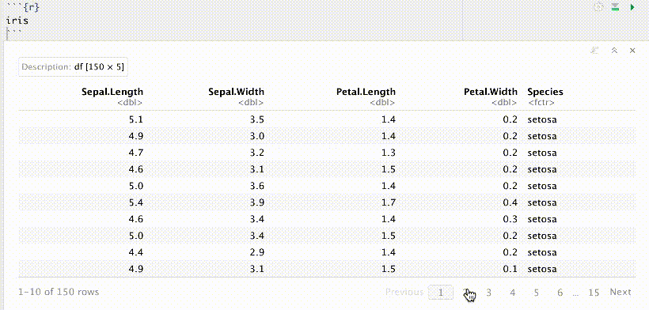
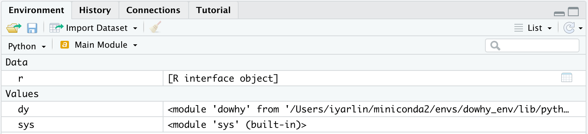
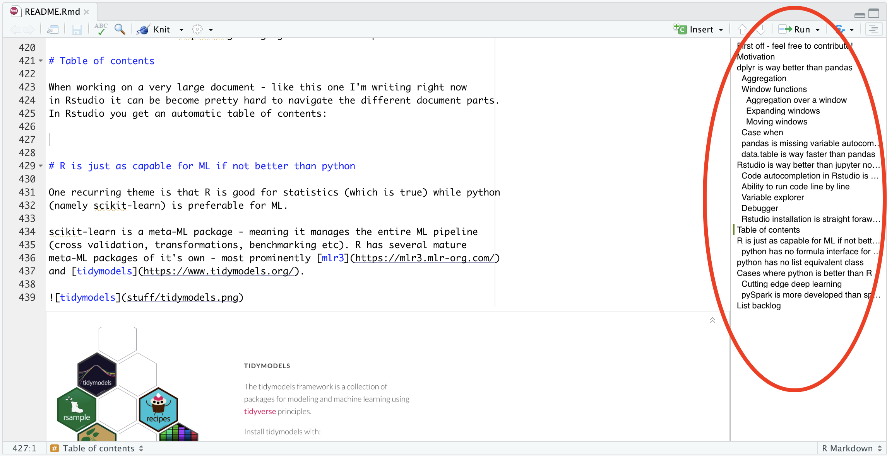
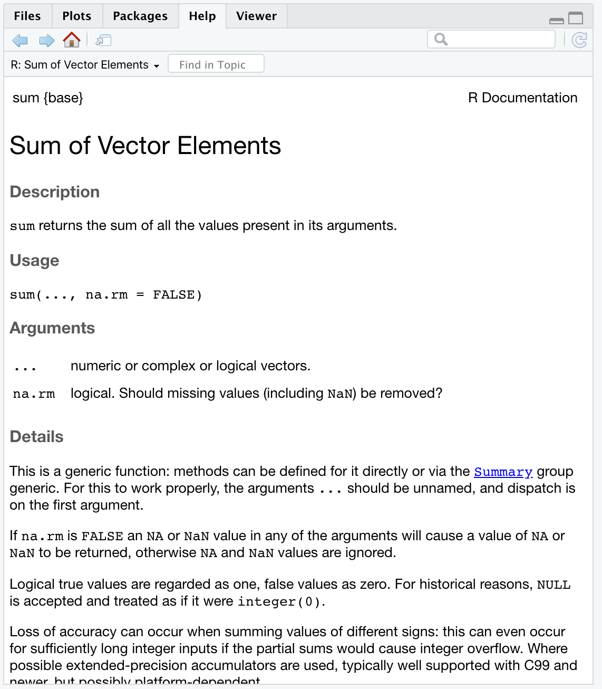
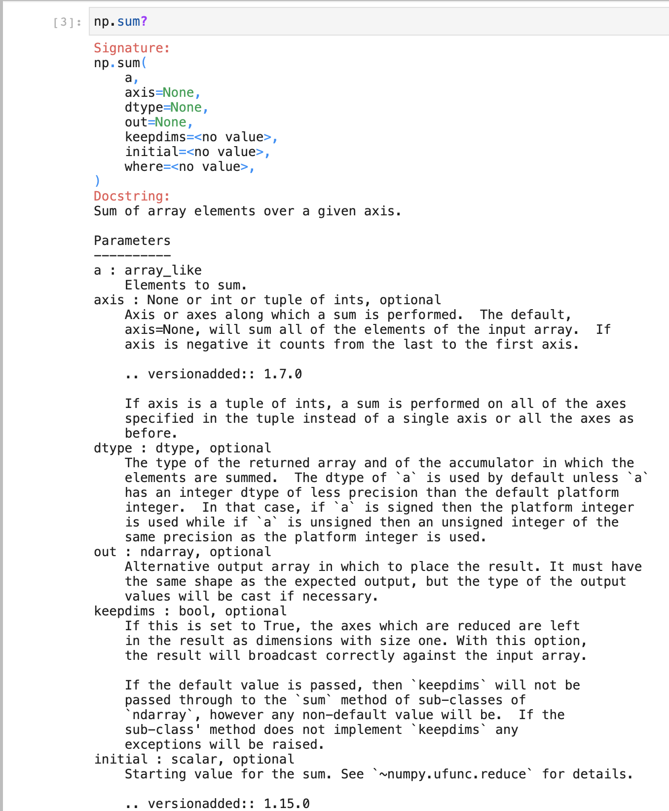
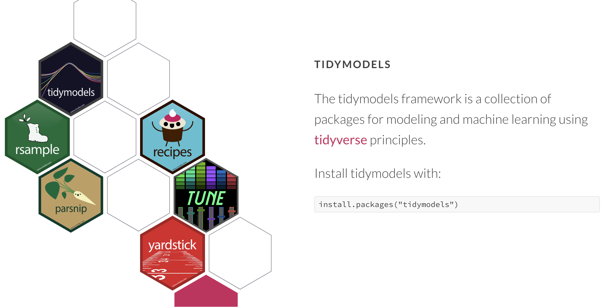
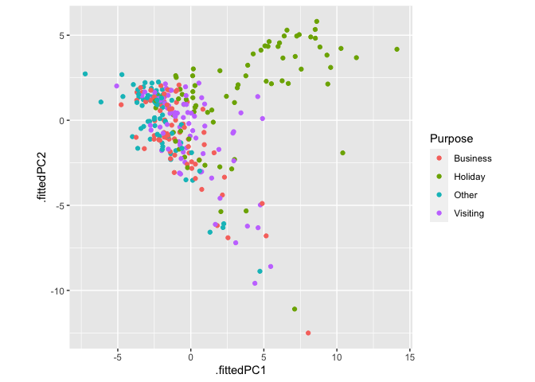
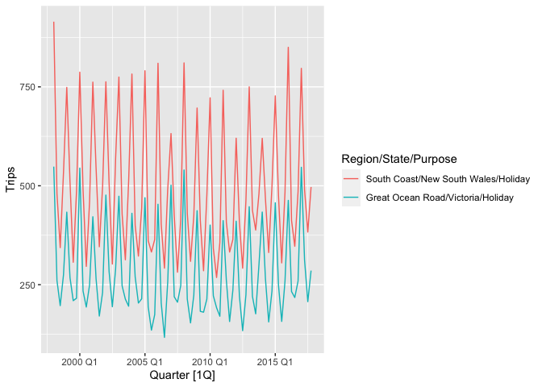

R advantages over python
================
Iyar Lin
16 June, 2022

-   [Motivation](#motivation)
    -   [How to contribute](#how-to-contribute)
-   [Working with dplyr is much faster than
    pandas](#working-with-dplyr-is-much-faster-than-pandas)
    -   [Aggregation](#aggregation)
        -   [Multiple input variables (weighted average
            example)](#multiple-input-variables-weighted-average-example)
        -   [Multiple functions on multiple input
            variables](#multiple-functions-on-multiple-input-variables)
    -   [Window functions](#window-functions)
        -   [Aggregation over a window](#aggregation-over-a-window)
        -   [Expanding windows](#expanding-windows)
        -   [Moving windows](#moving-windows)
    -   [Case when](#case-when)
    -   [Coalesce](#coalesce)
    -   [pandas is missing variable
        autocompletion](#pandas-is-missing-variable-autocompletion)
    -   [When you learn dplyr you can also leverage data.table, spark,
        postgres and many
        others](#when-you-learn-dplyr-you-can-also-leverage-datatable-spark-postgres-and-many-others)
    -   [data.table is way faster than
        pandas](#datatable-is-way-faster-than-pandas)
    -   [pandas index](#pandas-index)
-   [Rstudio IDE is way better than jupyter
    notebooks](#rstudio-ide-is-way-better-than-jupyter-notebooks)
    -   [Code autocompletion](#code-autocompletion)
    -   [Console](#console)
    -   [Running code line by line](#running-code-line-by-line)
    -   [Table viewing is interactive](#table-viewing-is-interactive)
    -   [Variable explorer](#variable-explorer)
    -   [Debugger](#debugger)
    -   [Installation and dependency
        management](#installation-and-dependency-management)
    -   [Table of contents](#table-of-contents)
    -   [Documentation rendering](#documentation-rendering)
-   [R is just as capable for ML if not better than
    python](#r-is-just-as-capable-for-ml-if-not-better-than-python)
    -   [sklearn does not support categorical variables in decision
        trees](#sklearn-does-not-support-categorical-variables-in-decision-trees)
-   [Time series](#time-series)
    -   [Feature extraction for clustering or search unusual time
        series](#feature-extraction-for-clustering-or-search-unusual-time-series)
-   [python has no list equivalent
    class](#python-has-no-list-equivalent-class)
-   [Package management and
    distribution](#package-management-and-distribution)
    -   [Depndencies management](#depndencies-management)
    -   [Documentation](#documentation)
-   [Vectorization](#vectorization)
-   [Cases where python is better than
    R](#cases-where-python-is-better-than-r)
    -   [Cutting edge deep learning](#cutting-edge-deep-learning)
    -   [pySpark is more developed than sparkR/sparklyr
        (?)](#pyspark-is-more-developed-than-sparkrsparklyr-)
-   [List backlog](#list-backlog)

<br>

*“don’t be fooled by the hype python’s got*  
*R still R still is the tool you want”*


# Motivation

R has many advantages over python that should be taken into
consideration when choosing which language to do DS with. When compiling
them in this repo I try to avoid:

1.  Too subjective comparisons. E.g. function indentation vs curly
    braces closure.
2.  Issues that one can get used to after a while like python indexing
    (though the fact it starts from 0, or that object\[0:2\] returns
    only the first 2 elements still throws me off once in a while).

## How to contribute

I’m adding examples to this repo as I encounter them. There are areas
such as dashboards and apps, advanced statistics or production
environments with which I’m less familiar with. If you’d like to add
examples, including where python has the edge over R (there’s a small
[section](#python_better_than_r) for that) feel free to add them to this
README and open a pull request.

**I encourage the reader to point out cases where I’m wrong** - for
example when better ways to perform a task in python exist. I appreciate
the feedback.

Note this repo has a [discussions
section](https://github.com/IyarLin/R-advantages-over-python/discussions)
so feel free to comment there.

# Working with dplyr is much faster than pandas

Many popularity comparisons show stack overflow questions to indicate
that pandas popularity is growing much faster than dplyr. I think that
at least some of the increase in pandas questions has to do with how
confusing pandas is. I hope by the end of this section you’ll find merit
in my hypothesis.

<figure>

<figcaption aria-hidden="true">pandas vs dplyr questions on stack
overflow</figcaption>
</figure>

<a name="aggregation"></a>

## Aggregation

This section will demonstrate that pandas syntax really contrasts with
the principle from Zen of python: “There should be one— and preferably
only one —obvious way to do it”.

We’ll start with a simple example: calculate the mean Sepal length
within each species in the iris dataset.

In dplyr:

``` r
iris %>%
  group_by(Species) %>%
  summarise(mean_length = mean(Sepal.Length))
```

A common way of doing the same in pandas would be using the *agg*
method:

``` python
(
  iris
  .groupby('Species')
  .agg({'Sepal.Length':'mean'})
  .rename({'Sepal.Length':'mean_length'}, axis = 1)
)
```

We can see that pandas requires an additional *rename* call.

We can avoid the additional *rename* by passing a tuple to *agg*:

``` python
iris.groupby('Species').agg(mean_length = ('Sepal.Length', 'mean'))
```

When aggregating over a single column we could pass a string rather than
a tuple like so:

``` python
iris.groupby('Species')['Sepal.Length'].agg(mean_length = 'mean')
```

When aggregating over a single column with a function that is also a
DataFrame method one could skip the *agg* method altogether using:

``` python
iris.groupby('Species')['Sepal.Length'].mean()
```

The above demonstrated again how confusing pandas can be with all those
different ways of doing the same thing.

### Multiple input variables (weighted average example)

Now let’s say we’d like to use a weighted average (with sepal width as
weights).

In dplyr we’d use the weighted mean function with an additional
argument:

``` r
iris %>%
  group_by(Species) %>%
  summarize(weighted_mean_length = weighted.mean(Sepal.Length, Sepal.Width))
```

Pretty straight forward. In fact, it’s so straight forward we can do the
actual weighted mean calculation on the fly:

``` r
iris %>%
  group_by(Species) %>%
  summarize(weighted_mean_length = sum(Sepal.Length * Sepal.Width) / sum(Sepal.Width))
```

In pandas I found an
[answer](https://stackoverflow.com/questions/10951341/pandas-dataframe-aggregate-function-using-multiple-columns/10964938#10964938)
which got 104 upvotes on stack overflow:

``` python
def weighted_mean(group):
    d = {}
    x = group['Sepal.Length']
    w = group['Sepal.Width']
    d['weighted_mean_length'] = (x * w).sum() / w.sum()
    return (x * w).sum() / w.sum()

(
  iris
  .groupby('Species')
  .apply(weighted_mean)
)
```

Problem is - we get back a series, not a DataFrame. I’ve searched stack
overflow some more and combined the above with this
[answer](https://stackoverflow.com/questions/14529838/apply-multiple-functions-to-multiple-groupby-columns/47103408#47103408)
(look how long it is!) to get the following:

``` python
def weighted_mean(group):
    d = {}
    x = group['Sepal.Length']
    w = group['Sepal.Width']
    d['weighted_mean_length'] = (x * w).sum() / w.sum()
    return pd.Series(d, index=['weighted_mean_length'])

(
  iris
  .groupby('Species')
  .apply(weighted_mean)
)
```

We can see that:  
1. We have to define a custom function, and it can’t even work for
general inputs  
but rather has to have them hard coded.  
2. The syntax is super cumbersome and requires searching stack overflow
extensively.  
3. We need to use *apply* instead of the common *agg* method.  
4. I’m pretty sure anyone not using the above code for more than a few
weeks would have to search stack overflow/his code base again to find
the answer next time he needs to do that calculation.

Following a [Christophe’s](https://medium.com/@christopherpynn) comment
on my Medium post I found out there’s a much simpler solution:

``` python
(
  iris
  .groupby('Species')
  .apply(lambda x: pd.Series({'weighted_mean_length': 
    np.average(x['Sepal.Length'], weights = x['Sepal.Width'])}))
)
```

Quite surprising given the amount of upvotes those stack overflow
answers got.

Another comment by [Samuel
Oranyeli](https://gist.github.com/samukweku/88272c539743e9507dd275e1d2d71018)
revealed one could actually use the *pipe* method like so:

``` python
(
  iris
  .assign(weighted_sum = iris['Sepal.Length'].mul(iris['Sepal.Width']))
  .groupby('Species')
  .pipe(lambda df: df.weighted_sum.sum()/df['Sepal.Width'].sum())
)
```

So… using yet another new method: *pipe*, which quite frankly I have a
hard time understanding how is different than *apply*. (There’s an
active stack overflow
[question](https://stackoverflow.com/questions/47226407/pandas-groupby-pipe-vs-apply#:~:text=1%20Answer&text=What%20pipe%20does%20is%20to,that%20was%20passed%20to%20apply%20.)
on that).

### Multiple functions on multiple input variables

Let’s say we’d like to calculate the mean and max sepal length, and the
min sepal width.

In dplyr it’s easy enough:

``` r
iris %>% summarise(
  sepal_length_mean = mean(Sepal.Length), 
  sepal_length_max = max(Sepal.Length), 
  sepal_width_min = min(Sepal.Width))
```

    ##   sepal_length_mean sepal_length_max sepal_width_min
    ## 1          5.843333              7.9               2

If you were to group it by Species for example, you’d get the exact same
data frame, only this time with a row per each species like you’d
expect:

``` r
iris %>% 
  group_by(Species) %>% 
  summarise(
  sepal_length_mean = mean(Sepal.Length), 
  sepal_length_max = max(Sepal.Length), 
  sepal_width_min = min(Sepal.Width))
```

    ## # A tibble: 3 × 4
    ##   Species    sepal_length_mean sepal_length_max sepal_width_min
    ##   <chr>                  <dbl>            <dbl>           <dbl>
    ## 1 setosa                  5.01              5.8             2.3
    ## 2 versicolor              5.94              7               2  
    ## 3 virginica               6.59              7.9             2.2

In pandas you get a very different behavior when the data frame is
grouped or not. When it’s ungrouped:

``` python
(
  iris
  .agg({'Sepal.Length':['mean', 'max'], 'Sepal.Width':'min'})
)
```

    ##       Sepal.Length  Sepal.Width
    ## mean      5.843333          NaN
    ## max       7.900000          NaN
    ## min            NaN          2.0

We can see that the function names were stored in the index while the
variables on which they were operated on are in the columns. This
results in all those pesky NaNs.

If we were to apply those functions to a grouped data frame however:

<a name="multi_index"></a>

``` python
(
  iris
  .groupby('Species')
  .agg({'Sepal.Length':['mean', 'max'], 'Sepal.Width':'min'})
)
```

    ##            Sepal.Length      Sepal.Width
    ##                    mean  max         min
    ## Species                                 
    ## setosa            5.006  5.8         2.3
    ## versicolor        5.936  7.0         2.0
    ## virginica         6.588  7.9         2.2

Now the grouping variable levels occupy the row index while the
functions and variables were moved to the column multi index. It prints
nicely but also begs the question which you’ll have go search stack
overflow of how do you rename those columns or select them by name.

Well what if you just want to perform several aggregations without
grouping? Only way I found doing that was:

``` python
(
  iris
  .groupby(lambda x: 1)
  .agg({'Sepal.Length':['mean', 'max'], 'Sepal.Width':'min'})
)
```

    ##   Sepal.Length      Sepal.Width
    ##           mean  max         min
    ## 1     5.843333  7.9         2.0

## Window functions

### Aggregation over a window

Let’s say we’d like to calculate the mean of sepal length within each
species and append that to the original dataset (In SQL:
SUM(Sepal.Length) OVER(partition by Species)) would be:

``` python
iris.assign(mean_sepal = lambda x: x.groupby('Species')['Sepal.Length'].transform(np.mean))
```

We can see that this requires a dedicated method (*transform*), compared
with dplyr which only requires adding a group_by:

``` r
iris %>%
  group_by(Species) %>%
  mutate(mean_sepal = mean(Sepal.Length))
```

Now let’s say we’d like to do the same with a function that takes 2
argument variables. In dplyr it’s pretty straight forward and again,
just a minor and intuitive tweak of the previous code:

``` r
iris %>%
  group_by(Species) %>%
  mutate(mean_sepal = weighted.mean(Sepal.Length, Sepal.Width))
```

Thanks to [Samuel
Oranyeli](https://gist.github.com/samukweku/88272c539743e9507dd275e1d2d71018)
I now know this can be achieved in pandas using:

``` python
(
  iris
  .assign(weighted_sum = iris['Sepal.Length'].mul(iris['Sepal.Width']), 
             mean_sepal = lambda df: df.groupby('Species')
                                       .pipe(lambda df: df.weighted_sum.transform('sum')/
                                                        df['Sepal.Width'].transform('sum'))
                                            )
     .drop(columns = "weighted_sum")
)
```

You can judge for yourself how elegant or straightforward this is.

### Expanding windows

Now let’s say we’d like to calculate an expanding sum of Sepal.Length
over increasing values of Sepal.Width within each species (in SQL:
SUM(Sepal.Length) OVER(partition by Species ORDER BY Sepal.Width))

In dplyr it’s pretty straight forward:

``` r
iris %>%
  arrange(Species, Sepal.Width) %>%
  group_by(Species) %>%
  mutate(expanding_sepal_sum = cumsum(Sepal.Length))
```

Generally for a function `f` we can use sapply like so:

``` r
f <- function(x) median(x) + 1
iris %>%
  arrange(Species, Sepal.Width) %>%
  group_by(Species) %>%
  mutate(expanding_median_plus_1 = sapply(1:n(), function(x) f(Sepal.Length[1:x])))
```

Notice we don’t need to memorize any additional functions/methods. One
finds a solution using ubiquitous tools (e.g. sapply) and just plugs it
in the dplyr chain.

In pandas we’ll have to search stack overflow to come up with the
*expanding* method:

``` python
(
  iris
  .sort_values(['Species', 'Sepal.Width'])
  .groupby('Species')
  .expanding().agg({'Sepal.Length': 'sum'})
  .rename({'Sepal.Length':'expanding_sepal_sum'}, axis = 1)
)
```

Again, we need to use an additional *rename* call.

You’d might want to pass a tuple to *agg* like you’re used to in order
to avoid the additional *rename* but for some reason the following
syntax just wont work:

``` python
(
  iris
  .sort_values(['Species', 'Sepal.Width'])
  .groupby('Species')
  .expanding()
  .agg(expanding_sepal_sum = ('Sepal.Length', 'sum'))
)
```

You could also avoid the additional rename by using the following
somewhat cumbersome syntax:

``` python
(
  iris
  .assign(expanding_sepal_sum = lambda x:x.sort_values(['Species', 'Sepal.Width'])
  .groupby('Species').expanding().agg({'Sepal.Length': 'sum'})
  .reset_index()['Sepal.Length'])
)
```

Yet another way of doing it (credit to [Samuel
Oranyeli](https://gist.github.com/samukweku/88272c539743e9507dd275e1d2d71018))
would be:

``` python
(
  iris
  .sort_values(["Species", "Sepal.Width"])
  .assign(expanding_sepal_sum = lambda df: df.groupby("Species")['Sepal.Length']
                                                .expanding()
                                                .sum()
                                                .array)
)
```

### Moving windows

Now let’s say we’d like to calculate a moving central window mean (in
SQL: AVG(Sepal.Length) OVER(partition by Species ORDER BY Sepal.Width
ROWS BETWEEN 2 PRECEDING AND 2 FOLLOWING))

As usual, in dplyr it’s pretty straightforward:

``` r
iris %>%
  arrange(Species, Sepal.Width) %>%
  group_by(Species) %>%
  mutate(moving_mean_sepal_length = sapply(
    1:n(),
    function(x) mean(Sepal.Length[max(x - 2, 1):min(x + 2, n())])
  ))
```

As in the other examples, all you have to do is find a solution using
ubiquitous tools and plug it in the dplyr chain.

In pandas we’d have to look up the *rolling* method, read it’s
documentation and come up with the following:

``` python
(
  iris
  .sort_values(['Species', 'Sepal.Width'])
  .groupby('Species')
  .rolling(window = 5, center = True, min_periods = 1)
  .agg({'Sepal.Length': 'mean'})
  .rename({'Sepal.Length':'moving_mean_sepal_length'}, axis = 1)
)
```

Yet another way of doing it (credit to [Samuel
Oranyeli](https://gist.github.com/samukweku/88272c539743e9507dd275e1d2d71018))
would be:

``` python
(
  iris
  .sort_values(["Species", "Sepal.Width"])
  .assign(expanding_sepal_sum = lambda df: df.groupby("Species")['Sepal.Length']
                                                .rolling(window=5, center=True, min_periods=1)
                                                .mean()
                                                .array)
)
```

## Case when

Below we can see an example of using a case when statement in dplyr:

``` r
iris %>%
  mutate(nice = case_when(
    Species == "setosa" & Sepal.Length < 5 ~ "value C",
    Species == "versicolor" & Sepal.Length < 5 ~ "Value A",
    Species == "virginica" & Sepal.Length < 5 ~ "Value G",
    T ~ "high"
  ))
```

pandas on the other hand [has no dedicated case when
function](https://github.com/pandas-dev/pandas/issues/39154). It uses
the **numpy** *select*:

``` python
iris.assign(wow = lambda x: np.select(
    [
        (x['Species'] == "setosa") & (x['Sepal.Length'] < 5), 
        (x['Species'] == "versicolor") & (x['Sepal.Length'] < 5),
        (x['Species'] == "virginica") & (x['Sepal.Length'] < 5)
    ], 
    [
        'value C', 
        'value A',
        'value G'
    ], 
    default='high'))
```

We can see that:

1.  The syntax is way less readable. In order to match condition with
    outcome one needs to index the conditions and outcomes in his head  
2.  It can get quite messy to understand which value results from what
    condition if the list of conditions becomes long

## Coalesce

This function finds the first non-missing value at each position similar
to SQL coalesce.

For example we try to extract first non-missing value from 2 fields
otherwise return 0. In dplyr it makes pretty easy and readable

``` r
df <- tibble(s1=c(NA,NA,6,9,9),s2=c(NA,8,7,9,9))
df %>% mutate(s3=coalesce(s1,s2,0))
```

    ## # A tibble: 5 × 3
    ##      s1    s2    s3
    ##   <dbl> <dbl> <dbl>
    ## 1    NA    NA     0
    ## 2    NA     8     8
    ## 3     6     7     6
    ## 4     9     9     9
    ## 5     9     9     9

In pandas the solution is much less readable and concise:

``` python
df=pd.DataFrame({'s1':[np.nan,np.nan,6,9,9],'s2':[np.nan,8,7,9,9]})
df.assign(s3 = df.s1.combine_first(df.s2).fillna(0))
```

    ##     s1   s2   s3
    ## 0  NaN  NaN  0.0
    ## 1  NaN  8.0  8.0
    ## 2  6.0  7.0  6.0
    ## 3  9.0  9.0  9.0
    ## 4  9.0  9.0  9.0

## pandas is missing variable autocompletion

In dplyr data masking enables you to have variable completion when write
your code. See below how that looks like:


In pandas you pass strings when you select variables, use the *agg*,
*sort_values*, *query* and *groupby* methods. In all those cases - you
don’t get variable auto-completion.

## When you learn dplyr you can also leverage data.table, spark, postgres and many others

When you encounter use cases where pandas can’t be used (e.g. big data
and remote data bases) you’ll have to learn another package to tackle
them.

Dplyr users however can use the same syntax to tackle many use cases
using various other languages as back-ends. Granted, for advanced usage
one would probably have to resort to more dedicated API’s or use the
native language itself. But for the usual use cases of filtering,
selecting, aggregating etc using dplyr syntax should work fine.

The [dbplyr](https://dbplyr.tidyverse.org/) package enables using remote
database tables as if they are in-memory data frames by automatically
converting dplyr code into SQL. These include: Postgres, BigQuery,
Impala and many others.

The [sparklyr](https://spark.rstudio.com/) package enables connecting to
spark clusters and executing spark jobs by converting dplyr syntax to
Spark syntax.

The [dtplyr](https://dtplyr.tidyverse.org/) package enables working fast
with large data frames that still fit in memory by using the data.table
package as backend. You can see a [small
benchmarking](https://iyarlin.medium.com/data-table-speed-with-dplyr-syntax-yes-we-can-51ef9aaed585)
I did to see how effective it is.

## data.table is way faster than pandas

For most cases when working with data frames that fit in memory there
will probably be not difference in compute time between pandas and
dplyr/data.table. There are instances however when working with medium
to large datasets where pandas will significantly lag behind data.table.
There’s a whole [website](https://h2oai.github.io/db-benchmark/)
dedicated to benchmarking data base like operations across many
languages. We can see below an example where data.table is the fastest
out there, leaving pandas (among others) in the dust.


python users might rejoice over the fact pandas seems much faster than
dplyr. Thing is dplyr can use data.table as a backend and enjoy all the
[syntax joy](#aggregation) of dplyr [without losing much
steam](https://iyarlin.medium.com/data-table-speed-with-dplyr-syntax-yes-we-can-51ef9aaed585).

## pandas index

This one might be a bit subjective, but for me pandas index always seems
like much more of nuisance than useful. I encourage the reader to check
how many times they use the *reset_index* method in their code. Other
than some niceties relating to how the data frame is printed (e.g. multi
indeces, see [this](#multi_index) for example) I can’t think of a use
case where an index is really needed.

# Rstudio IDE is way better than jupyter notebooks

When working with python one might opt to use the [spyder
IDE](https://www.spyder-ide.org/). Last time I checked it was a poor
mans’ Rstudio so I restrict my comparison to jupyter notebooks which are
by far the most popular IDE for DS python.

Working with Rmarkdown within Rstudio really feels like jupyter
notebooks on steroids. In addition to the ability to assemble code,
plots and tables within the same document you get tons of other useful
features. Since there are some many, below I’ll list just a few notable
features that make Rstudio so much better to work with than jupyter
notebooks.

## Code autocompletion

Below we can see a code completion example in Rstudio:


We can see that:

1.  When calling functions you get documentation of arguments on the go,
    both overview and detailed in pop-up windows  
2.  Used arguments don’t show up in the auto-completion (after setting x
    it doesn’t show up again)  
3.  When calling functions in a dplyr chain you have the data frame
    variables listed and autocompleted (thanks to data masking)

In contrast see below the auto-completion results for pandas DataFrame
in jupyter notebooks:

 We can see you get a long
list of irrelevant stuff.

## Console

Rstudio has a command line - this comes handy whenever you want to
execute short pieces of code to check stuff, not to have it in your
script. Not having this in Jupyter notebooks is a pain that is
compounded by the absence of the following feature:

## Running code line by line

Running code line by line can be especially important when you want to
debug a chunk of code. See an example below:

<a name="previous_example"></a>


In jupyter notebooks you’d have to copy each line separately to a new
cell, fix indentation and run it. You can’t even just copy it to a
console!.

In the above we not only see how easy it is to debug a function in
Rstudio, we also see a run status bar on the left showing you exactly
where the error occurred when running the chunk as a whole (which can
also be useful when running big chunks to know where in the chunk your
code runs right now).

Using Rstudio version 1.4.1106 on Mac I can also run python code line by
line.

## Table viewing is interactive

When viewing tables with lots of rows it’s useful to be able to scroll
them row wise:



In jupyter you can only scroll column wise.

## Variable explorer

In the [previous example](#previuos_example) we could also see a
variable explorer which does not exist in jupyter notebooks. Comes handy
especially when context switching or to dynamically inspect results
(e.g. number of rows in a filtered dataframe).

I’m using Rstudio version 1.4.1106 and when using the reticulate package
to work with python I have a variable explorer. At this rate using
Rstudio would be preferable over jupyter notebooks even when using
python.



## Debugger

Rstudio has a full fledged [visual
debugger!](https://support.rstudio.com/hc/en-us/articles/205612627-Debugging-with-RStudio)
The Jupyter blog
[announced](https://blog.jupyter.org/a-visual-debugger-for-jupyter-914e61716559)
a visual debugger back in March 2020 but I have yet to see it installed
anywhere in practice. It’s possible that’s due to the fact it’s still
experimental and available for a specific kernel type.

*“The only kernel implementing this protocol, for now, is xeus-python a
new Jupyter kernel for the Python programming language”*

This naturally leads to the next point:

## Installation and dependency management

To take advantage of all the features in Rstudio you need only download
the latest version and install. Jupyter notebooks are much more
fragmented with many of the more advanced features installed separately,
often working on only subsets of machines or requiring managing all
sorts of dependencies.

## Table of contents

When working on a very large document - like this one I’m writing right
now in Rstudio it can be become pretty hard to navigate the different
document parts. In Rstudio you get an automatic table of contents:



<a name="documentation_render"></a>

## Documentation rendering

Documentation in Rstudio is rendered very nicely in a separate window,
supporting all sorts of formatting. See for example:



In jupyter notebooks however doc strings are printed within the
notebook, so if it’s long one has to scroll up and down to view both the
doc and the code he wants to edit:



# R is just as capable for ML if not better than python

One recurring theme is that R is good for statistics (which is true)
while python (namely scikit-learn) is preferable for ML.

scikit-learn is a meta-ML package - meaning it manages the entire ML
pipeline (cross validation, transformations, benchmarking etc). R has
several mature meta-ML packages of it’s own - most prominently
[mlr3](https://mlr3.mlr-org.com/) and
[tidymodels](https://www.tidymodels.org/).



You can read more about mlr3 and tidymodels in this great [blog
post](https://medium.com/analytics-vidhya/meta-machine-learning-aggregator-packages-in-r-round-ii-71ee1ff68642).
While it’s hard to compare sklearn with the R packages, it’s safe to say
R has no shortage of high quality meta-ML packages.

## sklearn does not support categorical variables in decision trees

This one’s actually pretty important. When constructing a tree in R on a
dataset that contains a categorical variable it can send several
categories down each node.

To show that I’ll use the iris dataset and create a “sub-species”
variable which is just a split in half of every species (so 6 levels
overall).

We next fit a tree model:

``` r
library(rpart)
set.seed(1)
iris_for_tree <- iris %>%
  mutate(
    subspecies =
      paste0(Species, sample.int(2,
        size = n(),
        replace = T
      ))
  ) %>%
  select(Sepal.Length, subspecies)

rpart(Sepal.Length ~ subspecies, data = iris_for_tree, cp = 0.02)
```

    ## n= 150 
    ## 
    ## node), split, n, deviance, yval
    ##       * denotes terminal node
    ## 
    ## 1) root 150 102.1683 5.843333  
    ##   2) subspecies=setosa1,setosa2 50   6.0882 5.006000 *
    ##   3) subspecies=versicolor1,versicolor2,virginica1,virginica2 100  43.4956 6.262000  
    ##     6) subspecies=versicolor1,versicolor2 50  13.0552 5.936000 *
    ##     7) subspecies=virginica1,virginica2 50  19.8128 6.588000 *

We can see that on the first split 2 categories (setosa1,setosa2) went
down the left node while the rest went to the right - which makes sense
as there’s no real difference between setosa1 and setosa2. In the end
the tree split the nodes exactly according to the original species!

sklearn however [does not support categorical
data](https://scikit-learn.org/stable/modules/tree.html#tree-algorithms-id3-c4-5-c5-0-and-cart).
This means we have to one hot encode those - effectively meaning you can
only do one vs the rest splitting. In the example above setosa1 and
setosa2 can’t be sent together to the same node and you’d end up making
bad splits with the same specie in different leaves. This can have
serious implications, especially in cases where categories with a large
number of levels are present in the dataset.

# Time series

While some effort is underway to close the gap (see for example
[pmdarima](https://github.com/alkaline-ml/pmdarima) package which aims
to imitate R’s auto.arima) python’s packages for time series analysis,
especially in more classic contexts like exponential smoothing are still
way less developed.

Of course,there are models of classical arima and models from the family
of exponential smoothing (ETS) in statmodels,but they all require
painstaking manual settings of hyperparameters (p, d,q,P, D, Q) of each
time series or parameters from the family of exponential models.

The realities of forecasting in the conditions of modern business are
such that there are many (very many) time series, they are all of
different lengths, many of them are far from stationary and often
contain omissions and statistical outliers.

A single framework is required that could decide for itself for each
time series what is more appropriate model (ARIMA, regression, theta,
prophet or one of the representatives of the ETC family) not to mention
not to manually configure the parameters of ARIMA/ETC/… for each time
series.

This framework should contain convenient tools for visualizing a variety
of time series and model prediction results, and the code should be
concise and readable (which is not enough in python)

This framework should contain convenient tools for cross-validation of
time series and building different models for each time series in
conditions when there are many time series.

This framework should have tools for hierarchical forecasting: this is
when the time series of the detailed (lower) level are aggregated to
different levels up in time (per week, month, year), by product (brand,
category, etc.) or by customers (staff, sales channel, etc.) and then
the models, having learned at the levels above, transmit the found
patterns to the models of the lower level, which they cannot see from
their height.

This framework should be able to extract characteristics from each time
series (regardless of their length and nature) so that later clustering
of time series can be done based on these characteristics.

This collection of packages is called
[tydieverts](https://tidyverts.org/) and the book was written by Rob
Hyndman, well-known in the circles of forecasting specialists, already
the 3rd edition [Forecasting: Principles and
Practice](https://otexts.com/fpp3/) in accordance with the evolution of
packages. (By the way, statmodels likes to refer to this author in the
help for their forecasting functions).

The concept of the tydiverts ecosystem is completely identical to the
concept of the [tidyverse](https://www.tidyverse.org/) ecosystem and,
accordingly, everything is compatible between these two families, which
gives explosive performance and code readability.

Below is an example of forecasting a set of time series by a set of
models based on the fable package

``` r
pckgs <- c('fable','fable.prophet','tsibble','feasts')
# install.packages(pckgs) # install packages of 'tidyverts' ecosystem
lapply(X = c(pckgs,'tidyverse'), FUN = library, character.only = TRUE) # load 'tidyverts' + 'tidyverse' packages
```

``` r
# extract and filter multiple timeseries data frame from tsibble datasets
data(tourism,package = 'tsibble')
tourism_melb <- tourism %>% filter(Region == "Melbourne",State=="Victoria") %>% select(-Region,-State)
tourism_melb # you can see "Key: Purpose" in title (4 time series groups:Business,Holiday,Visiting,Other), see tsibble docs about create key
```

    ## # A tsibble: 320 x 3 [1Q]
    ## # Key:       Purpose [4]
    ##    Quarter Purpose  Trips
    ##      <qtr> <chr>    <dbl>
    ##  1 1998 Q1 Business  405.
    ##  2 1998 Q2 Business  408.
    ##  3 1998 Q3 Business  486.
    ##  4 1998 Q4 Business  429.
    ##  5 1999 Q1 Business  361.
    ##  6 1999 Q2 Business  486.
    ##  7 1999 Q3 Business  359.
    ##  8 1999 Q4 Business  426.
    ##  9 2000 Q1 Business  495.
    ## 10 2000 Q2 Business  499.
    ## # … with 310 more rows

``` r
tourism_melb %>% autoplot(.vars = Trips) # plot multiple timeseries in on line of code
```

<!-- -->

``` r
train <- tourism_melb %>% filter_index(~'2015 Q4') # filter time series from start to 4Q 2015
fit <- train %>% # create multiple AUTO-tuning models for each time series by tsibble key
  model(
    ets = ETS(Trips ~ trend("A")), # auto Exponential models (HOLT, HOLT-Winters,...etc)
    arima = ARIMA(Trips), # auto ARIMA
    snaive=SNAIVE(Trips), # seasonal NAIVE
    #tslm=TSLM(log(Trips)~ trend() + season()),  # YOU MAY (UN)COMMENT ANY MODEL WITHOUT CODE CORRECTION BELOW!!! (regression with trend + seasonal)
    theta=THETA(Trips), # theta model
    prophet=prophet(Trips~ season("year", 4, type = "multiplicative"))
    ) %>% 
  mutate(combine=(ets+arima+snaive+prophet+theta)/5) # create model ensemble
fit
```

    ## # A mable: 4 x 7
    ## # Key:     Purpose [4]
    ##   Purpose           ets        arima   snaive   theta   prophet       combine
    ##   <chr>         <model>      <model>  <model> <model>   <model>       <model>
    ## 1 Business <ETS(A,A,A)> <NULL model> <SNAIVE> <THETA> <prophet> <COMBINATION>
    ## 2 Holiday  <ETS(M,A,A)> <NULL model> <SNAIVE> <THETA> <prophet> <COMBINATION>
    ## 3 Other    <ETS(M,A,N)> <NULL model> <SNAIVE> <THETA> <prophet> <COMBINATION>
    ## 4 Visiting <ETS(A,A,A)> <NULL model> <SNAIVE> <THETA> <prophet> <COMBINATION>

``` r
fc <- fit %>% forecast(h = "2 years") # create forecasts from each model for each timeseries
fc
```

    ## # A fable: 192 x 5 [1Q]
    ## # Key:     Purpose, .model [24]
    ##    Purpose  .model Quarter        Trips .mean
    ##    <chr>    <chr>    <qtr>       <dist> <dbl>
    ##  1 Business ets    2016 Q1 N(470, 3380)  470.
    ##  2 Business ets    2016 Q2 N(546, 3470)  546.
    ##  3 Business ets    2016 Q3 N(562, 3560)  562.
    ##  4 Business ets    2016 Q4 N(530, 3651)  530.
    ##  5 Business ets    2017 Q1 N(475, 3741)  475.
    ##  6 Business ets    2017 Q2 N(551, 3831)  551.
    ##  7 Business ets    2017 Q3 N(567, 3922)  567.
    ##  8 Business ets    2017 Q4 N(535, 4012)  535.
    ##  9 Business arima  2016 Q1           NA   NA 
    ## 10 Business arima  2016 Q2           NA   NA 
    ## # … with 182 more rows

``` r
fc %>% autoplot(tourism_melb) # plot forecast and actual values by one line of code
```

<!-- -->

``` r
ac <- fc %>% accuracy(data = tourism_melb,measures = list(mape=MAPE, rmse=RMSE)) %>% 
  relocate(Purpose,.before = .model)%>% arrange(Purpose,rmse) # evaluate models accuracy by test period (>'2015 Q4')
ac
```

    ## # A tibble: 24 × 5
    ##    Purpose  .model  .type   mape  rmse
    ##    <chr>    <chr>   <chr>  <dbl> <dbl>
    ##  1 Business prophet Test   11.4   84.0
    ##  2 Business snaive  Test   15.1  111. 
    ##  3 Business ets     Test   15.2  116. 
    ##  4 Business theta   Test   16.0  122. 
    ##  5 Business arima   Test  NaN    NaN  
    ##  6 Business combine Test  NaN    NaN  
    ##  7 Holiday  prophet Test    7.27  72.4
    ##  8 Holiday  ets     Test    7.78  76.7
    ##  9 Holiday  theta   Test    7.91  84.3
    ## 10 Holiday  snaive  Test    9.46  88.7
    ## # … with 14 more rows

``` r
best_ac <- ac %>% group_by(Purpose) %>% arrange(rmse) %>% slice(1) %>% ungroup() # get best model for each time series by min(rmse)
best_ac # we can see that for 'Business' and 'Holiday'  it prophet, for 'Other' and 'Visiting' - ARIMA 
```

    ## # A tibble: 4 × 5
    ##   Purpose  .model  .type  mape  rmse
    ##   <chr>    <chr>   <chr> <dbl> <dbl>
    ## 1 Business prophet Test  11.4   84.0
    ## 2 Holiday  prophet Test   7.27  72.4
    ## 3 Other    ets     Test   7.60  14.1
    ## 4 Visiting prophet Test  11.2  101.

``` r
fc_bestmodels <- fc %>% inner_join(best_ac,by = c('Purpose','.model')) %>% tibble() %>% 
  select(Purpose,  Quarter, frcst_val = .mean,.model) # get best forecast values
fc_bestmodels
```

    ## # A tibble: 32 × 4
    ##    Purpose  Quarter frcst_val .model 
    ##    <chr>      <qtr>     <dbl> <chr>  
    ##  1 Business 2016 Q1      478. prophet
    ##  2 Business 2016 Q2      565. prophet
    ##  3 Business 2016 Q3      609. prophet
    ##  4 Business 2016 Q4      574. prophet
    ##  5 Business 2017 Q1      493. prophet
    ##  6 Business 2017 Q2      588. prophet
    ##  7 Business 2017 Q3      628. prophet
    ##  8 Business 2017 Q4      586. prophet
    ##  9 Holiday  2016 Q1      688. prophet
    ## 10 Holiday  2016 Q2      622. prophet
    ## # … with 22 more rows

## Feature extraction for clustering or search unusual time series

Below is a small example of how to use the [feasts
package](https://feasts.tidyverts.org/) extract characteristics from
time series for their subsequent clustering or search for unusual
examples after dimension compression

``` r
# https://robjhyndman.com/hyndsight/fbtsa/
# Compute features
tourism # 304 timeseries (key[304] in table title)
```

    ## # A tsibble: 24,320 x 5 [1Q]
    ## # Key:       Region, State, Purpose [304]
    ##    Quarter Region   State           Purpose  Trips
    ##      <qtr> <chr>    <chr>           <chr>    <dbl>
    ##  1 1998 Q1 Adelaide South Australia Business  135.
    ##  2 1998 Q2 Adelaide South Australia Business  110.
    ##  3 1998 Q3 Adelaide South Australia Business  166.
    ##  4 1998 Q4 Adelaide South Australia Business  127.
    ##  5 1999 Q1 Adelaide South Australia Business  137.
    ##  6 1999 Q2 Adelaide South Australia Business  200.
    ##  7 1999 Q3 Adelaide South Australia Business  169.
    ##  8 1999 Q4 Adelaide South Australia Business  134.
    ##  9 2000 Q1 Adelaide South Australia Business  154.
    ## 10 2000 Q2 Adelaide South Australia Business  169.
    ## # … with 24,310 more rows

``` r
tourism_features <- tourism %>% features(Trips, feature_set(pkgs="feasts"))
tourism_features # 50(!!!) features extracted for each time series by 1 line of code
```

    ## # A tibble: 304 × 45
    ##    Region         State Purpose trend_strength seasonal_streng… seasonal_peak_y…
    ##    <chr>          <chr> <chr>            <dbl>            <dbl>            <dbl>
    ##  1 Adelaide       Sout… Busine…          0.464            0.407                3
    ##  2 Adelaide       Sout… Holiday          0.554            0.619                1
    ##  3 Adelaide       Sout… Other            0.746            0.202                2
    ##  4 Adelaide       Sout… Visiti…          0.435            0.452                1
    ##  5 Adelaide Hills Sout… Busine…          0.464            0.179                3
    ##  6 Adelaide Hills Sout… Holiday          0.528            0.296                2
    ##  7 Adelaide Hills Sout… Other            0.593            0.404                2
    ##  8 Adelaide Hills Sout… Visiti…          0.488            0.254                0
    ##  9 Alice Springs  Nort… Busine…          0.534            0.251                0
    ## 10 Alice Springs  Nort… Holiday          0.381            0.832                3
    ## # … with 294 more rows, and 39 more variables: seasonal_trough_year <dbl>,
    ## #   spikiness <dbl>, linearity <dbl>, curvature <dbl>, stl_e_acf1 <dbl>,
    ## #   stl_e_acf10 <dbl>, acf1 <dbl>, acf10 <dbl>, diff1_acf1 <dbl>,
    ## #   diff1_acf10 <dbl>, diff2_acf1 <dbl>, diff2_acf10 <dbl>, season_acf1 <dbl>,
    ## #   pacf5 <dbl>, diff1_pacf5 <dbl>, diff2_pacf5 <dbl>, season_pacf <dbl>,
    ## #   zero_run_mean <dbl>, nonzero_squared_cv <dbl>, zero_start_prop <dbl>,
    ## #   zero_end_prop <dbl>, lambda_guerrero <dbl>, nsdiffs <int>, bp_stat <dbl>, …

``` r
# Unusual time series can be identified by first doing a principal components decomposition
pcs <- tourism_features %>% select(-State, -Region, -Purpose) %>% prcomp(scale=TRUE) %>% augment(tourism_features) 
pcs %>% ggplot(aes(x=.fittedPC1, y=.fittedPC2, col=Purpose)) + geom_point() + theme(aspect.ratio=1)
```

<!-- -->

``` r
# We can then identify some unusual series.
unusual <- pcs %>% filter(.fittedPC1 > 10.5) %>% select(Region, State, Purpose, .fittedPC1, .fittedPC2)

# plot unusual time series by 1 line of code
tourism %>% semi_join(unusual) %>% autoplot()
```

<!-- -->

Achieving the same with python would’ve taken much more code and effort.

# python has no list equivalent class

In R the list data structure let’s one store arbitrary objects in a
vector which can be accessed by both element index and element name. For
example:

``` r
r_list <- list(
  a_vector = c("a", "c", "R"), a_scalar = 3,
  another_list = list("yay", c(1, 3))
)

## access by index:
r_list[[1]]

## access by names:
r_list$a_scalar
```

In python one can either store data in a list which can be accessed by
element index but has no names:

``` python
python_list = [["a","c","R"], 3, ["yay", [1,3]]]
python_list[2]
```

or in a dictionary which allows accessing elements by name but not by
element index (in fact it has no ordering at all!)

``` python
python_dict = {
'a_vector':["a","c","R"], 
'a_scalar':3, 
'another_list':["yay", [1,3]]}
python_dict['a_vector']
```

# Package management and distribution

In R every package that is hosted on CRAN needs to satisfy a list of
requirements that ensure it’s well documented and usable.

One might argue that this stifles code sharing but package hosting and
installing from github is pretty straightforward in R. I do that myself.

pypi on the other hand has no such standards and as a result, you never
really know what you get.


*credit to Adam Soffer for the brilliant reference*

Below I elaborate on a couple of issues that arise from this setup:

## Depndencies management

R package versions rarely break your code - things that used to work
just keep working in new versions.

When you pick up a new library in python it’s not rare to need to either
downgrade or look up very specific library versions that work with the
one you’re trying to use. This problem is so big that using virtual
environments becomes almost a necessity in order to have any change of
managing all the dependencies across different projects. The headache
doesn’t end there as you’ll need to make sense of which virtual
environment tool to use: there’s venv, virtualenv, pyenv and many more!
You can see some of the confusion manifested in this [stack
overflow](https://stackoverflow.com/questions/41573587/what-is-the-difference-between-venv-pyvenv-pyenv-virtualenv-virtualenvwrappe)
question.

The *packrat* or *renv* packages in R fulfills the same functionality
but one rarely **has** to use them. It’s more for maintaining
reproducibility.

## Documentation

Documentation in R has a predetermined structure. They all need to have
a title, a description, usage pattern, arguments, details section etc
which makes reading new documentation much easier because you know what
to expect and where to look for the information you’re after.

R documentation is also [rendered very nicely in the Rstudio
IDE](#documentation_render) (not strictly an R feature by itself I
admit).

# Vectorization

In R the basic objects are all vectors and thus vectorized operations
are natural. In python however the basic objects are lists so one has to
either use list comprehensions which are less readable and slower or
convert the lists to numpy arrays to get the same vectorization
capabilities.

For example let’s say we’d like to multiply all elements of a vector by
2. In R:

``` r
myVector <- 1:5
myVector * 2
```

    ## [1]  2  4  6  8 10

Doing the same for a list would look like this:

``` python
myList = [1,2,3,4,5]
[i*2 for i in myList]
```

    ## [2, 4, 6, 8, 10]

This can be really slow for very large vectors. We could import the
numpy module to get the same functionality:

``` python
import numpy as np
myVector = np.arange(1,6,1) # notice how the "to" argument is 6 rather than 5.
myVector * 2
```

    ## array([ 2,  4,  6,  8, 10])

Here’s another example: Suppose we’d like to pick elements of a vector
based on another boolean/index vector. In R:

``` r
indexVector <- 1:5
valueVector <- LETTERS[indexVector]
greaterThan2 <- indexVector > 2
valueVector[greaterThan2]
```

    ## [1] "C" "D" "E"

Using python lists isn’t so straight forward. Based on this stack
overflow [answer](https://stackoverflow.com/a/3179119) (which got 147
upvotes - to a question that got 113 upvotes as of 10.6.2021) you’d need
to use list comprehension like so:

``` python
indexVector = [1,2,3,4,5]
valueVector = [r.LETTERS[i - 1] for i in indexVector]
greaterThan2 = [indexVector[i] > 2 for i in range(len(indexVector))]
[val for is_good, val in zip(greaterThan2, valueVector) if is_good]
```

    ## ['C', 'D', 'E']

Way less elegant and possibly slow for large vectors. It’s so un-elegant
that a special function was written to accomplish the task:

``` python
from itertools import compress
list(compress(valueVector, greaterThan2))
```

    ## ['C', 'D', 'E']

Even that solution is pretty cumbersome compared with the R native way
of doing it.

One has to use numpy to enjoy the same functionality:

``` python
import numpy as np
indexVector = np.arange(1,6)
valueVector = np.array(r.LETTERS)[indexVector]
greaterThan2 = indexVector > 2
valueVector[greaterThan2]
```

    ## array(['D', 'E', 'F'], dtype='<U1')

<a name="python_better_than_r"></a>

# Cases where python is better than R

Below are a few cases where I concede python can be easier/faster to
work with than R.

## Cutting edge deep learning

Both R and python has mature API’s for the 2 main deep learning
frameworks - tensorflow and pytorch. Both also have an API for Keras.
These probably cover the vast majority of use cases in deep learning.

For the most cutting edge models it might be preferable to use python
directly (instead of through *reticulate*) as these are usually
developed with python and their experimental nature often necessitates
being able to look under the hood and dealing with complex
configurations.

## pySpark is more developed than sparkR/sparklyr (?)

One of the most popular tools to deal with big data is Apache Spark.
Both python and R has API’s for spark (*pyspark* for python and *SparkR*
and *sparklyr* in R).

The beauty of *sparklyr* is that it enables one to use spark with dplyr
syntax. So if you know dplyr you get spark for free. Pretty good for
standard operations.

Until recently I thought pyspark was more advanced than SparkR due to
having pandas UDF, but now I’m not entirely sure as I just read a
[post](https://cosminsanda.com/posts/a-compelling-case-for-sparkr/)
about how to deploy pretty much every R ML package using the Spark
engine.

# List backlog

Below is a list of points I might develop into full examples. Feel free
to pick one and expand on it!

-   A point for python: Classes are easier to understand compared with
    S3 as the membership definition is more transparently tied to the
    class. Also figuring out which methods exist for a given class can
    be challenging in R.

-   Add to pandas index section the annoying part of assigning values to
    a dataframe slice. See this
    <https://stackoverflow.com/questions/20625582/how-to-deal-with-settingwithcopywarning-in-pandas>

-   R has great utilities for package writing - roxygen2 for example.

-   Plotting in R is much better This may be a bit subjective as to
    which graphics look better - ggplot2 or matplotlib/seaborn. python
    has also plotnine but it’s way less feature rich, and does not have
    the myriad of extension package as in r (e.g. gganimate).

-   Many folks like to say that one of python’s greatest advantages is
    that it’s a general programming language. Now, I have to admit I
    don’t understand what that means in practice. But I do feel it’s
    true in the sense that it feels like python wasn’t build for DS from
    ground up. For that reason mathematical constructs are a 2nd class
    citizens in it. This is most apparent in the amount of libraries
    involved with basic DS operations, each with it’s own code
    philosophy (pandas, numpy, sklearn, scipy etc). In R it all just
    fits together. Talk about tidyverse in contrast.

-   python copy inplace is really confusing (x = y, if you change y so
    does x)

-   Rmarkdown greatly expands the ability to communicate results,
    especially with non technical colleagues. It easily let’s one render
    his Rmd into word, html, md, pdf etc and share those. I have an
    entire site built using Rmarkdown. In order to view ipynb files one
    needs access to github or specialized software.

-   dplyr syntax can be used with multiple backends: spark, postgres,
    data.table and many others. While some functionality may not be
    supported, it can still save a lot of time.

-   test editing tools in Rstudio are superb (find and replace etc)
