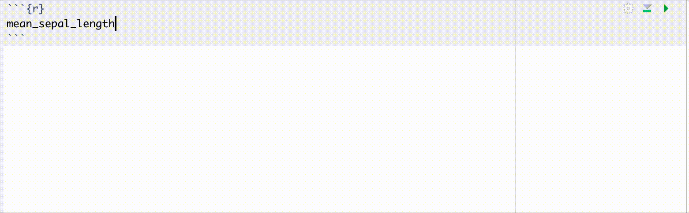

All the reasons R is better than python
================
Iyar Lin
21 April, 2021

  - [First off - feel free to
    contribute\!](#first-off---feel-free-to-contribute)
  - [Motivation](#motivation)
  - [dplyr is way better than pandas](#dplyr-is-way-better-than-pandas)
      - [pandas is missing variable
        autocompletion](#pandas-is-missing-variable-autocompletion)
      - [Aggregation in dplyr is way more intuitive than
        pandas](#aggregation-in-dplyr-is-way-more-intuitive-than-pandas)
      - [Window functions in dplyr are way better than in
        pandas](#window-functions-in-dplyr-are-way-better-than-in-pandas)
          - [Aggregation over a window](#aggregation-over-a-window)
          - [Expanding windows](#expanding-windows)
      - [pandas case when is annoying](#pandas-case-when-is-annoying)
  - [Rstudio is way better than jupyter
    notebooks](#rstudio-is-way-better-than-jupyter-notebooks)
      - [Code autocompletion in Rstudio is way better than jupyter
        notebooks](#code-autocompletion-in-rstudio-is-way-better-than-jupyter-notebooks)
  - [python has no formula interface for
    models](#python-has-no-formula-interface-for-models)
  - [python has no list equivalent
    class](#python-has-no-list-equivalent-class)
  - [List backlog](#list-backlog)
  - [Markdown Editor](#markdown-editor)

<br>

*"don’t be fooled by the hype that python caught*  
*R still R still is the thing you want"*


# First off - feel free to contribute\!

In this document I’ll be curating examples of cases where working with R
is notably faster than python. This is a living document which I’ll keep
updating as I come across new examples. Also, if you’d like to extend
the list feel free to open a pull request.

**I encourage the reader to point out cases where I’m wrong** - for
example when better ways to perform a task in python exist. If I come
across cases where python is notably faster I’ll be sure to add them
too.

Note this repo has a [discussions
section](https://github.com/IyarLin/r-is-better-than-python-for-ds/discussions)
so feel free to comment there.

# Motivation

99.9% of all DS tasks can be done using either R ot python - so why does
it even matter which one is used? The answer is: Speed. The iterative
nature of DS development means that the faster a practitioner can
transform ideas to code and the faster that code executes - the more
ideas he can explore and iterate over and the more productive he
becomes.

One can probably do 99.9% of DS tasks with C++ too. But you don’t see
too many practitioners do that - it takes too long\!

The argument I’ll be supporting throughout this entire document is that
**90% of DS tasks can be done with R much faster than with python**.

Now, I know this topic is getting pretty old - there’s a myriad of posts
on the topic. (I’ve actually
[posted](https://iyarlin.github.io/2019/07/11/my_2_cents_on_the_r_vs_python_squabble/)
on the subject in the past.) Still, most are confined to high level,
very subjective comparisons. See
[here](https://www.guru99.com/r-vs-python.html#:~:text=R%20is%20mainly%20used%20for,of%20course%2C%20the%20ideal%20solution.&text=Python%20is%20a%20general%2Dpurpose%20language%20with%20a%20readable%20syntax.)
for example: “R is difficult to learn at the beginning while Python is
Linear and smooth to learn” - why? No code examples are provided, survey
results etc. Even
[this](https://medium.com/@datadrivenscience/python-vs-r-for-data-science-and-the-winner-is-3ebb1a968197)
piece on medium which got quite a few claps isn’t very helpful in
answering which language should one pick.

Granted, many aspects of the topic are subjective to some extent. E.g.
which language is easier to learn varies a lot between different
practitioners. I do think that a thorough comparison can greatly inform
those who weigh which language to adopt for their DS team for example.

Also, I can imagine sometimes there’s special cases which make python
preferable to R (e.g. cutting edge deep learning, production environment
limitations) but I believe that R is still the better choice in the vast
majority of cases. At any rate it’s worth being aware of what you lose
when choosing python over R.

# dplyr is way better than pandas

Many popularity comparisons show stackoverflow questions to indicate
that pandas popularity is growing much faster than dplyr. I think that
at least some of the increase in pandas questions has to do with how
confusing pandas is to all those new comers. I hope by the end of this
section you’ll find merit in my hypothesis.


## pandas is missing variable autocompletion

In dplyr data masking enables you to have variable completion when
writing your code. See below how that looks like:



In pandas whenever you select variables, pass variables to agg method,
use sort\_values, use filter method and many other cases you pass string
variables names, meaning no autocompletion for you.

## Aggregation in dplyr is way more intuitive than pandas

We’ll start with a simple example: calculate the mean Sepal length
within each species in the iris dataset.

In dplyr:

``` r
mean_sepal_length <- iris %>% 
  group_by(Species) %>% 
  summarise(mean_length = mean(Sepal.Length))
```

A common way of doing the same in pandas would be using the *aggregate*
method:

``` python
mean_sepal_length = (
  iris.groupby('Species').agg({'Sepal.Length':'mean'})
  .rename({'Sepal.Length':'mean_length'}, axis = 1)
)
```

We can see that pandas requires an additional *rename* call.

A better way to use *agg* would be:

``` python
mean_sepal_length = (
  iris.groupby('Species').agg(mean_length = ('Sepal.Length', 'mean'))
)
```

While this looks much closer to the dplyr syntax, it also highlights the
fact there’s multiple ways of using the agg method.

Now let’s say we’d like to use a weighted average (with Sepal width as
weights).

In dplyr it would be:

``` r
sepal_length_to_width_ratio <- iris %>%
  group_by(Species) %>%
  summarize(weighted_mean_length = weighted.mean(Sepal.Length, Sepal.Width))
```

We naturally just added an argument column to the weighted mean
function.

In pandas it’s not so simple. One can’t just tweak the above examples.
To come up with a pandas version I had to search stackoverflow and based
on [this](https://stackoverflow.com/a/10964938/5472037) and
[this](https://stackoverflow.com/a/47103408/5472037) answers I got:

``` python
def weighted_mean(group):
    d = {}
    x = group['Sepal.Length']
    w = group['Sepal.Width']
    d['weighted_mean_length'] = (x * w).sum() / w.sum()
    return pd.Series(d, index=['weighted_mean_length'])

sepal_length_to_width_ratio = (
  iris
  .groupby('Species')
  .apply(weighted_mean)
)
```

We can see that:  
1\. We have to define a custom function, and it can’t even work for
general inputs  
but rather has to have them hard coded.  
2\. The syntax is super cumbersome and requires searching
stackoverflow.  
3\. We need to use *apply* instead of the common *agg* method.

## Window functions in dplyr are way better than in pandas

### Aggregation over a window

Let’s say we’d like to calculate the mean of sepal length within each
species and append that to the original dataset (In SQL:
SUM(Sepal.Length) OVER(partition by Species)) would be:

``` python
iris.assign(mean_sepal = lambda x: x.groupby('Species')['Sepal.Length'].transform(np.mean))
```

We can see that this requires a dedicated method (*transoform*),
compared with dplyr which which builds on the familiar basic syntax:

``` r
iris %>% group_by(Species) %>% mutate(mean_sepal = mean(Sepal.Length))
```

I wasn’t able to come up with a way to use a function with more than 1
input such as weighted mean in pandas. In dplyr it’s pretty straight
forward and again, just a minor and intuitive tweak of the previuos
code:

``` r
iris %>% group_by(Species) %>% mutate(mean_sepal = weighted.mean(Sepal.Length, Sepal.Width))
```

### Expanding windows

Now let’s say we’d like to calculate an expanding sum (in SQL:
SUM(Sepal.Length) OVER(partition by Species ORDER BY Sepal.Width))

In dplyr it’s pretty straight forawrd:

``` r
iris %>% arrange(Species, Sepal.Width) %>% group_by(Species) %>% 
  mutate(expanding_sepal_sum = sapply(1:n(), function(x) sum(Sepal.Length[1:x])))
```

Notice we don’t need to memorise any additional functions/methods. You
find solution using ubiquitous tools (e.g. sapply) and just plug it in
the dplyr chain.

In pandas we’ll have to search stackoverflow to come up with the
*expanding* method:

``` python
(
  iris.sort_values('Sepal.Length').groupby('Species')
  .expanding().agg({'Sepal.Length': 'sum'})
  .rename({'Sepal.Length':'expanding_sepal_sum'}, axis = 1)
)
```

Again, we need to use an additional *rename* call.

You’d might want to pass a tuple to *agg* like you’re used to in order
to avoid the additional *rename* but for some reason the following
syntax just wont work:

``` python
(
  iris.sort_values('Sepal.Length').groupby('Species')
  .expanding().agg(expanding_sepal_sum = ('Sepal.Length', 'sum'))
)
```

## pandas case when is annoying

# Rstudio is way better than jupyter notebooks

## Code autocompletion in Rstudio is way better than jupyter notebooks

Below we can see a code completion example in Rstudio:


We can see that

1.  When calling functions you get documentation of arguments on the go,
    both overview and detailed in pop-up windows  
2.  Used arguments don’t show up in the autocompletion (after setting x
    it doesn’t show up again)  
3.  When calling functions in a dplyr chain you have the data frame
    variables listed and autocompleted (thanks to data masking)

In constrast see below the autocompletion results for pandas DataFrame
in jupyter notebooks:

 We can see you get a long
list of irrelevant stuff.

# python has no formula interface for models

This is another way to use models which can be quite convenient and
powerful at times. Saves a lot of time when you don’t want to go all in
with dedicated transformation code.

# python has no list equivalent class

In R the list data structure let’s one store arbitrary objects in a
vector which can be accessed by both element index and element name. For
example:

``` r
r_list <- list(a_vector = c("a","c","R"), a_scalar = 3, 
               another_list = list("yay", c(1,3)))

## access by index:
r_list[[1]]
```

    ## [1] "a" "c" "R"

``` r
## access by names:
r_list$a_scalar
```

    ## [1] 3

In python one can either store data in a list which can be accessed by
element index but has no names:

``` python
python_list = [["a","c","R"], 3, ["yay", [1,3]]]
python_list[2]
```

    ## ['yay', [1, 3]]

or in a dictionary which allows accessing elements by name but not by
element index (in fact it has no ordering at all\!)

``` python
python_dict = {
'a_vector':["a","c","R"], 
'a_scalar':3, 
'another_list':["yay", [1,3]]}
python_dict['a_vector']
```

    ## ['a', 'c', 'R']

# List backlog

  - R Rstudio IDE is superior to Jupyter notebooks in every single way.
    It’s notebook features are better, it’s installation is easier and
    comes with all features. Some versions of jupyter might have some of
    the features - e.g.  variable explorer but it’s the difficulty of
    installing those that makes those features rarely available in
    practice and increase friction when setting up the environment.

  - python has spyder which is a poor man’s version of Rstudio, so no
    point discussing it.

  - In Rstudio you can run notebooks/scripts line by line. Can’t do that
    in jupyter. Rstudio also has a console while jupyter doesn’t. Both
    of these mean for example when debugging a function you need to copy
    each row to a new cell and run it, keep track of what’s happening in
    your head because you don’t have a variable explorer either. (I’ve
    seen that a visual debugger was introduced lately but I haven’t seen
    it used anywhere).

  - Not having a variable explorer can also be confusing especially if
    you context switch and need to remember what cells have you ran
    already. Variable explorer also enables quick inspection of the
    variables (so you can see right away that the function you ran
    returned a 0-row data frame for example).

  - Sketchy: Code completion in Rstudio is much better, and starts to
    support python too.

  - Indentation in python is annoying - if you want to copy multiline
    code between sections with different indentation levels (e.g. from a
    cell to within a function - show a small example) that can be super
    annoying.

  - Line breaks are also annoying in python. python is said to be more
    elegant but I find those "" at every line ending pretty weird.
    Another option would be putting entire expressions in parenthesis,
    which again, is less elegant.

  - R dplyr syntax is way easier to learn and use than pandas.
    Aggregation example.  

  - another example: setting column type can’t be done in a pipe

  - Pipes in dplyr are natural. In pandas you often need to use
    different methods (e.g. query instead of the usual filter, assign
    instead of regular assignment). Some operation can’t be done in pipe
    (change variable type)

  - R data.table is way faster than pandas. Can even use dplyr syntax
    with it.  

  - R documentation is standardized which makes it easier to read. It
    also renders.  
    very nicely in the Rstudio IDE. python documentation has no specific
    structure. In many cases it’s sorely lacking.  

  - On that same vein - R has great utilities for package writing -
    roxygen2 for example.

  - CRAN enforces quality standards (such as documentation). One could
    argue this stifles package writing and sharing but hosting packages
    and installing them is super easy - show syntax.  

  - As a result of the above, python packages dependencies break a lot.
    The need for virual environments is a testament for that issue.
    There’s a way to create virtual envs in r but one rarely needs them.
    See also accepted answer here:
    <https://stackoverflow.com/questions/14529838/apply-multiple-functions-to-multiple-groupby-columns>

  - In cases python has some functionality missing in R, the reticulate
    package in R let’s one import any python module directly into the R
    session (All pandas examples in this report are written inside an R
    script. You can also see an example in my [blog
    post](https://iyarlin.github.io/2020/04/20/dowhy_exploration/) that
    uses the dowhy library from within R). Python has several packages
    that aim to do the same but none are as mature.  

  - Python sklearn decision trees do not support categorical features -
    only 1-hot encoded ones. This means you can only do splits of
    1-vs-rest in categorical features. This could have significant
    effects, especially for variables with a large number of
    categories.  

  - Plotting in R is much stronger. This may be a bit subjective as to
    which graphics look better - ggplot2 or matplotlib/seaborn. python
    has also plotnine but it’s way less feature rich, and does not have
    the myriad of extension pacakge as in r (e.g. gganimate).  

  - It is said that python is better for ML due to sklearn. But has mlr
    and tidymodels, both very capable meta ML packages.

  - python was not built from the ground up for DS. For that reason
    mathematical constructs are a 2nd class citizens in it. This is most
    apparent in the amount of libraries invovled with basic DS
    operations, each with it’s own code philosphy (pandas, numpy,
    sklearn, scipy etc). In R it all just fits together.

  - Pandas index is pretty useless. You can see how often you’ll use
    reset\_index(). )

  - python copy inplace is really confusing (x = y, if you change y so
    does x)

  - python indexing starts with 0 which is confusing

  - Rmarkdown greatly expands the ability to communicate results,
    especially with non technical colleagues. It easily let’s one render
    his Rmd into word, html, md, pdf etc and share those. I have an
    entire site built using Rmarkdown. In order to view ipynb files one
    needs access to github or specialized software.

  - dplyr syntax can be used with multiple backends: spark, postgres,
    data.table and many others. While some functionality may not be
    supported, it can still save a lot of time.

**python strong points** - R spark interface is less powerful. For
example: pandas UDF. - Cutting edge DL is usually written in python.
Other than that all API’s are available in both (not sure to what degree
they differ)

# Markdown Editor
